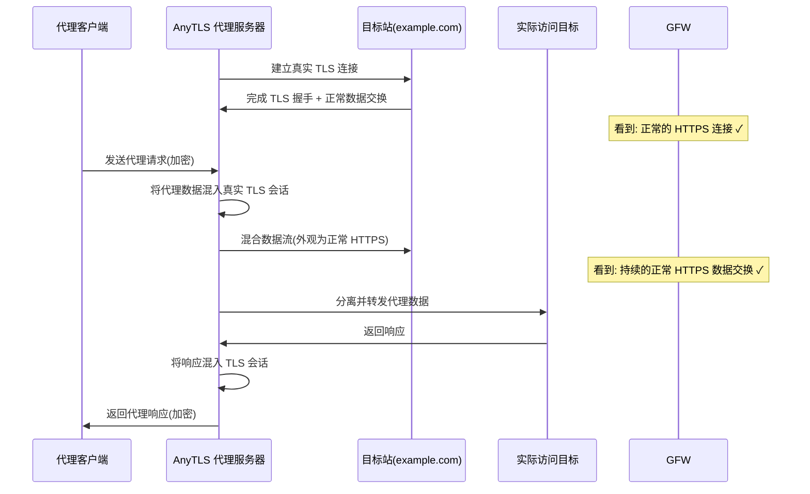
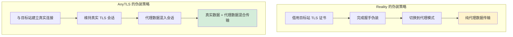
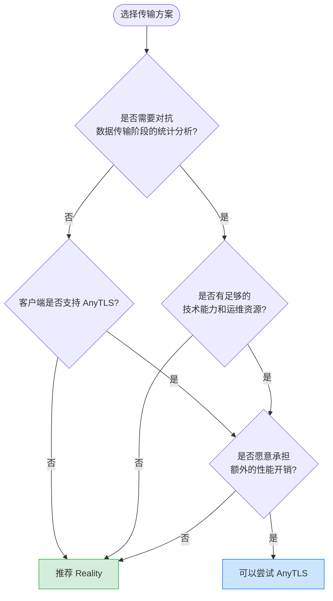

> **摘要**：AnyTLS 是一种针对 TLS-in-TLS 检测问题提出的代理传输方案。与 Reality 在握手阶段借用目标站证书不同，AnyTLS 的思路是与目标网站建立一条真实的 TLS 连接，然后在这条已建立的 TLS 会话中混入代理数据。两者代表了两种截然不同的抗检测哲学。本文深入解析 AnyTLS 的工作原理、技术优劣势、与 Reality 的对比，以及实际部署中的选择建议。

## TLS-in-TLS 问题回顾

在讨论 AnyTLS 之前，需要先理解它试图解决的核心问题。

当代理客户端通过 TLS 隧道访问一个 HTTPS 网站时，会出现一个结构性问题：外层是客户端与代理服务器之间的 TLS 连接，内层是客户端通过代理访问目标网站时产生的 TLS 连接。这就是所谓的 **TLS-in-TLS**——加密隧道内部嵌套了另一层加密隧道。

问题在于，内层 TLS 握手的数据包有非常明显的长度和时序特征。GFW 的深度包检测（DPI）系统虽然无法解密外层 TLS 的内容，但可以通过分析加密数据包的长度序列来推断内部是否嵌套了另一个 TLS 会话。如果一条"普通的 HTTPS 连接"内部持续出现符合 TLS 握手模式的数据包长度分布，审查者就有理由怀疑这是一条代理连接。

现有的应对方案包括 Xray 的 `xtls-rprx-vision`（通过对内层握手包进行 padding 来打破长度特征）和 Reality（在握手阶段借用真实证书）。而 [AnyTLS](https://github.com/anytls/anytls) 提供了第三种思路：既然 TLS-in-TLS 的特征难以完全消除，那就直接建立一条真实的 TLS 连接，让代理数据在真实 TLS 会话的掩护下传输。

## AnyTLS 是什么

AnyTLS 是由 [anytls 项目](https://github.com/anytls/anytls)开发的一种代理传输技术。它的核心目标是让代理流量与真实的 HTTPS 流量在网络层面上难以区分，但采用的方法与 Reality 截然不同。

**Reality 的思路**是在 TLS 握手阶段做文章——借用目标站的真实证书完成握手伪装，握手成功后再切换到代理数据传输模式。整个过程中，代理服务器实际上并没有与目标站建立持续的数据连接，证书只是"借来用一下"。

**AnyTLS 的思路**则是在数据传输阶段做文章——代理服务器与目标网站之间建立一条真实的、完整的 TLS 连接，然后在这条真实连接的数据流中混入代理数据。从外部观察者的角度看，这条连接不仅握手是真实的，数据传输也是真实的，因为它确实在与目标网站进行通信。

简单来说：Reality 是"借皮"，AnyTLS 是"寄生"。

## 核心工作原理

AnyTLS 的运作过程可以分为以下几个阶段。

### 第一阶段：建立真实连接

代理服务器首先与一个预配置的目标网站（如一个高流量的 HTTPS 站点）建立一条标准的 TLS 连接。这条连接是完全真实的——使用目标站的真实证书、完成完整的 TLS 握手、可以正常交换 HTTP 数据。从网络层面看，这就是一台服务器在正常访问一个网站。

### 第二阶段：会话复用

当代理客户端需要传输数据时，AnyTLS 将代理数据编码并嵌入到这条已建立的真实 TLS 会话中。具体的混入方式涉及到数据的分片、编码和调度，目标是让混合后的流量在统计特征上尽可能接近正常的 HTTPS 数据交换。

### 第三阶段：数据分离与转发

代理服务器接收到混合数据后，将代理数据与正常网站数据分离，代理数据被转发到实际的目标地址，而与目标站的正常通信则继续维持，保持连接的"真实性"。

### 与传统代理的关键区别

传统的 TLS 代理（包括使用 Reality 的方案）在握手完成后，数据传输阶段的流量内容完全是代理数据。虽然外层 TLS 加密使内容不可见，但流量的统计特征（包大小分布、时序模式、持续时间等）可能与真实的 HTTPS 流量有所不同。

AnyTLS 的不同之处在于，它维持了一条真实的 HTTPS 数据流作为"载体"，代理数据嵌入其中。这意味着即使审查者对加密流量进行统计分析，也会看到真实的 HTTPS 数据交换模式——因为确实存在真实的数据交换。

## AnyTLS 与 Reality 的深度对比

AnyTLS 和 Reality 都是为了让代理流量不被 GFW 识别，但它们的技术哲学有着根本性的差异。理解这些差异，才能在实际部署中做出正确的选择。

### 伪装层次不同

| 维度 | Reality | AnyTLS |
|------|---------|--------|
| **伪装阶段** | TLS 握手阶段 | TLS 数据传输阶段 |
| **证书使用** | 借用目标站证书，握手后切换 | 建立真实连接，持续使用 |
| **与目标站的关系** | 获取证书后断开 | 维持持续连接 |
| **数据传输阶段** | 纯代理数据（加密） | 代理数据混入真实流量 |
| **连接真实性** | 握手真实，传输阶段无真实数据 | 全程真实 |

### 抗检测能力对比

**Reality 的检测风险**：

Reality 在 TLS 握手阶段几乎无懈可击——证书是真的、指纹是真的、SNI 是真的。但握手完成后，连接进入数据传输阶段时，流量内容完全是代理数据。如果 GFW 在握手后对流量进行深度统计分析（比如比较与同一目标站正常流量的差异），理论上存在被识别的可能性。此外，长时间保持连接但几乎不与 dest 站点进行 HTTP 数据交换，这种行为模式本身也可能引起关注。

**AnyTLS 的检测风险**：

AnyTLS 的优势在于数据传输阶段的流量中混合了真实的 HTTPS 数据。审查者在分析加密流量的统计特征时，会看到真实的数据交换模式。但它也有自身的风险：如果代理数据量远大于正常网站数据量，混合后的流量在数据量上可能与该目标站的典型访问模式不符。

### 设计哲学的差异

可以用一个比喻来理解两者的区别：

- **Reality** 像是拿着别人的身份证进入一栋大楼。门卫（GFW）检查身份证时发现是真的，于是放行。但进入大楼后，你的行为与身份证上的身份无关。如果有人跟踪你在大楼内的活动，可能会发现异常。

- **AnyTLS** 像是和一个有合法身份的人一起进入大楼，并且一直跟着这个人活动。门卫看到的是两个人正常出入，跟踪者看到的也是正常的访客行为。但维持这种"同行"关系需要额外的协调成本。

## 优势分析

### 真实的 TLS 连接

AnyTLS 最大的优势是连接的真实性。与目标站的 TLS 连接从始至终都是真实的——真实的证书、真实的数据交换、真实的会话维持。这意味着任何试图验证连接真实性的检测手段（包括主动探测）都会得到"这是一条正常连接"的结论。

### 更强的抗统计分析能力

由于数据传输阶段存在真实的 HTTPS 数据流，加密流量的统计特征（包大小分布、传输间隔等）更接近正常的网站访问。对于依赖流量统计特征进行检测的 DPI 系统来说，这种混合流量更难被识别。

### 无 TLS-in-TLS 特征

传统的 TLS 代理在加密隧道内传输的数据可能包含内层 TLS 握手的特征性包长度序列。AnyTLS 由于复用了真实的 TLS 会话，代理数据被融入到真实的 HTTPS 数据流中，内层 TLS 握手的特征被有效稀释。

## 劣势与局限

### 需要目标站配合

AnyTLS 要求代理服务器能够与目标站建立并维持稳定的 TLS 连接。这意味着目标站必须始终可达，且不能对来自代理服务器的连接进行限制（如频率限制、IP 封锁等）。如果目标站的服务出现波动，代理连接也会受到直接影响。

与 Reality 只需在握手阶段获取一次证书不同，AnyTLS 需要持续维护与目标站的连接，对目标站的可用性有着更强的依赖。

### 性能开销

维护与目标站的真实连接意味着额外的网络开销。每一次代理数据传输都需要同时处理与目标站的数据交换，数据的混入和分离也需要额外的计算资源。在高并发场景下，这种开销可能会变得显著。

相比之下，Reality 在握手完成后就不再与 dest 站点通信，数据传输阶段的开销与普通 TLS 代理几乎一致。

### 部署复杂度

AnyTLS 的配置比 Reality 更复杂。除了基本的代理参数外，还需要配置和维护与目标站的连接参数、数据混入策略等。目标站的选择也更加讲究——不仅要满足 TLS 版本和证书要求，还要考虑数据交换模式是否适合混入代理数据。

### 成熟度与生态

作为一个相对较新的项目，AnyTLS 的生态系统远不如 Reality 成熟。Reality 已经集成在 [Xray-core](https://github.com/XTLS/Xray-core) 中，被大量面板和管理工具支持，社区经验丰富，故障排查资料也相对充足。AnyTLS 在这些方面还处于早期阶段，遇到问题时可参考的资源有限。

## 客户端支持

目前 AnyTLS 的客户端支持情况如下：

| 客户端 | 支持状态 | 备注 |
|--------|---------|------|
| [sing-box](https://github.com/SagerNet/sing-box) | 已支持 | 主要的客户端支持 |
| Clash.Meta / mihomo | 待确认 | 关注项目更新 |
| Xray-core | 不支持 | Xray 使用自己的 Reality 方案 |
| V2Ray | 不支持 | 无集成计划 |

需要注意的是，AnyTLS 的客户端支持范围远小于 Reality。如果你使用的客户端不支持 AnyTLS，那么 Reality 仍然是更务实的选择。

## AnyTLS 与 Reality：如何选择

这两种方案并不是简单的"谁更好"的关系，而是适用于不同场景和需求。

### 推荐使用 Reality 的场景

- **多数用户的默认选择**：如果你没有特殊的抗检测需求，Reality 已经足够安全，且部署运维成本远低于 AnyTLS。
- **需要广泛客户端兼容的场景**：Reality 被几乎所有主流客户端支持，不用担心兼容性问题。
- **追求稳定性和性能的场景**：Reality 在握手后不依赖目标站，数据传输阶段的稳定性和性能与普通 TLS 代理一致。
- **运维资源有限的场景**：Reality 的配置和维护相对简单，社区经验丰富，遇到问题容易找到解决方案。

### 可以考虑 AnyTLS 的场景

- **对抗高强度流量分析**：如果你的网络环境中 DPI 系统已经开始对 TLS 代理的数据传输阶段进行统计分析，AnyTLS 的混合流量策略可能提供额外的保护。
- **技术探索和研究**：如果你对代理技术的前沿发展感兴趣，AnyTLS 代表了一种值得关注的新方向。
- **愿意承担额外运维成本**：部署 AnyTLS 需要更多的配置工作和持续维护，确保你有足够的技术能力和时间。

### 决策参考

## 常见问题

### Q: AnyTLS 是否已经经过实战验证？

AnyTLS 作为一个相对较新的项目，其实战经验远不如 Reality 丰富。Reality 自发布以来已经经历了多轮 GFW 升级的考验，社区积累了大量的部署和调优经验。AnyTLS 的长期抗检测表现还需要时间和更多用户的实际使用来验证。在生产环境中，建议将 AnyTLS 作为备选方案而非唯一方案。

### Q: AnyTLS 能和 VLESS 搭配使用吗？

AnyTLS 是一种传输层技术，理论上可以与不同的代理协议搭配。但具体的协议兼容性取决于实现方式和客户端支持。目前在 [sing-box](https://github.com/SagerNet/sing-box) 中的集成是最为成熟的实现。关于具体的协议搭配方式，建议参考 [AnyTLS 项目](https://github.com/anytls/anytls)的官方文档。

### Q: 目标站被封了怎么办？

与 Reality 类似，当 AnyTLS 使用的目标站被封锁或不可达时，代理连接也会受到影响。但 AnyTLS 对目标站的依赖更强——Reality 只在握手阶段需要目标站，而 AnyTLS 在整个连接生命周期内都需要维持与目标站的通信。因此，AnyTLS 需要更加仔细地选择目标站，建议选择极不可能被封锁的大型站点，并且准备多个备选目标站。

### Q: AnyTLS 和 NaiveProxy 有什么区别？

两者都追求更高程度的流量真实性，但实现路径不同。NaiveProxy 使用 Chromium 的网络栈来生成流量，从协议栈层面确保流量特征与真实浏览器一致。AnyTLS 则通过在真实 TLS 连接中混入代理数据来实现伪装。NaiveProxy 的方案更"彻底"但部署更复杂（需要编译 Chromium 组件），AnyTLS 的方案相对轻量但在流量混合的精细度上面临更多挑战。

## 相关链接

- [AnyTLS GitHub](https://github.com/anytls/anytls) - AnyTLS 项目仓库
- [sing-box](https://github.com/SagerNet/sing-box) - 支持 AnyTLS 的代理客户端
- [Xray-core](https://github.com/XTLS/Xray-core) - VLESS + Reality 的主要实现
- [REALITY](https://github.com/XTLS/REALITY) - Reality 协议项目
