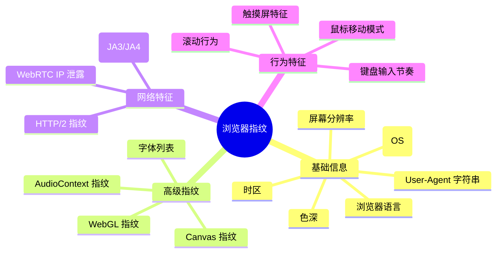
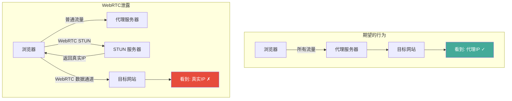
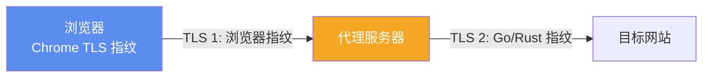
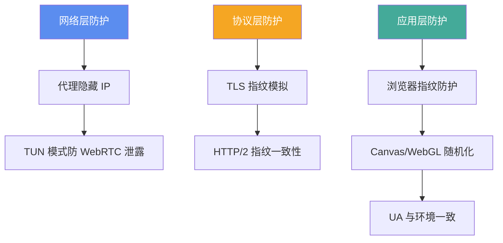

> **摘要**：很多人以为使用代理就实现了匿名上网——代理隐藏了你的真实 IP 地址，网站看不到你是谁。但现实远比这复杂。现代网站可以通过**浏览器指纹（Browser Fingerprint）**技术，在不依赖 IP 地址和 Cookie 的情况下追踪和识别用户。本文解析浏览器指纹的工作原理、常见的指纹维度、WebRTC 泄露问题，以及如何在使用代理的同时做好指纹防护。

## 什么是浏览器指纹

浏览器指纹是一种通过收集浏览器和设备的各种技术特征来生成唯一标识的技术。就像人类的指纹一样——虽然每个特征单独看并不唯一，但多个特征组合起来就可以唯一标识一个人。

一个典型的浏览器会暴露以下信息：



EFF（电子前哨基金会）的研究表明，通过组合这些特征，**83.6% 的浏览器可以被唯一标识**。如果加入 Flash 或 Java 插件信息（虽然现在已过时），这个比例高达 **94.2%**。

## 核心指纹维度详解

### User-Agent

这是最基本的指纹信息。User-Agent 字符串包含了浏览器名称、版本号、操作系统等信息：

```
Mozilla/5.0 (Windows NT 10.0; Win64; x64) AppleWebKit/537.36 (KHTML, like Gecko) Chrome/125.0.0.0 Safari/537.36
```

从这个字符串中可以提取出：
- 操作系统：Windows 10 64位
- 浏览器：Chrome 125
- 渲染引擎：Blink（AppleWebKit）

**与代理的关联**：很多代理客户端在 TLS 握手时会使用 `client-fingerprint: chrome` 来模拟 Chrome 的 TLS 指纹（如 VLESS+Reality 中）。但如果你实际使用的是 Firefox 浏览器，而 TLS 指纹是 Chrome 的，这种不匹配本身就是一个异常信号。

### Canvas 指纹

Canvas 是 HTML5 的绘图 API。不同的浏览器、操作系统、GPU 在渲染同一段绘图指令时，会产生微小的像素级差异——这些差异就是 Canvas 指纹。

```javascript
// 网站用来获取 Canvas 指纹的典型代码
const canvas = document.createElement('canvas');
const ctx = canvas.getContext('2d');
ctx.textBaseline = 'top';
ctx.font = '14px Arial';
ctx.fillStyle = '#f60';
ctx.fillRect(125, 1, 62, 20);
ctx.fillStyle = '#069';
ctx.fillText('BrowserFP', 2, 15);
// 将 canvas 转为数据并哈希，得到指纹
const fingerprint = canvas.toDataURL();
```

每台设备渲染出来的像素数据都略有不同（因为 GPU 驱动、字体渲染引擎、抗锯齿算法的差异），所以同样的绘图指令会产生不同的哈希值——这就是你的 Canvas 指纹。

### WebGL 指纹

类似 Canvas 指纹，但利用的是 WebGL（3D 图形）API。WebGL 会暴露更多硬件信息：

- GPU 渲染器名称（如 "ANGLE (NVIDIA GeForce RTX 4080)"）
- GPU 厂商
- 支持的 WebGL 扩展列表
- 着色器精度

这些信息组合起来可以非常精确地识别你的设备。

### AudioContext 指纹

浏览器的音频处理引擎在处理同一段音频数据时，也会因为硬件和软件差异产生微小的输出差异。AudioContext 指纹通过分析这些差异来识别设备。

### 字体指纹

通过 JavaScript 检测系统中安装了哪些字体。不同的操作系统预装不同的字体，用户也可能安装了额外的字体。字体列表的组合是一个很强的识别特征。

### 屏幕与硬件信息

```javascript
// 网站可以获取的屏幕/硬件信息
screen.width         // 屏幕宽度
screen.height        // 屏幕高度
screen.colorDepth    // 色深
navigator.hardwareConcurrency  // CPU 核心数
navigator.deviceMemory         // 设备内存（GB）
navigator.maxTouchPoints       // 触摸点数
```

## WebRTC：最危险的泄露源

### WebRTC 是什么

WebRTC（Web Real-Time Communication）是浏览器内置的实时通信技术，用于视频通话、语音通话、文件传输等点对点通信。为了建立直接连接，WebRTC 需要收集本机的所有网络接口信息——包括**本地 IP 地址**和**公网 IP 地址**。

### WebRTC 泄露原理

问题在于：WebRTC 的 IP 发现机制**绕过了代理设置**。即使你配置了 HTTP 代理或 SOCKS 代理，WebRTC 仍然可能通过 STUN 服务器发现你的**真实公网 IP**。



**关键点**：系统代理和浏览器代理设置通常不影响 WebRTC 的 STUN 请求——这些请求直接通过网络接口发送，绕过代理。

### WebRTC 泄露的检测

访问以下网站可以检测你的浏览器是否存在 WebRTC 泄露：

- [browserleaks.com/webrtc](https://browserleaks.com/webrtc)
- [ipleak.net](https://ipleak.net/)

如果在使用代理的情况下，这些网站仍然能显示你的真实 IP，就说明存在 WebRTC 泄露。

### WebRTC 泄露的防护

**方法一：使用 TUN 模式代理**

TUN 模式在系统层面创建虚拟网卡，所有流量（包括 WebRTC）都被强制通过代理。这是最彻底的解决方案。Clash Verge、sing-box 等客户端都支持 TUN 模式。

**方法二：浏览器扩展**

- [WebRTC Leak Prevent](https://chrome.google.com/webstore/detail/webrtc-leak-prevent/) — Chrome 扩展
- Firefox 内置设置：`about:config` 中设置 `media.peerconnection.enabled = false`

**方法三：浏览器设置禁用**

Chrome：安装 WebRTC 控制扩展或使用策略文件禁用
Firefox：`about:config` → `media.peerconnection.enabled` → `false`
Brave：内置 WebRTC 泄露保护

> ⚠️ **注意**：完全禁用 WebRTC 会导致部分网站的视频通话功能（如 Google Meet、Discord 语音）无法使用。

## TLS 指纹与代理的关系

TLS 指纹（JA3/JA4）是另一个重要的指纹维度。当浏览器与服务器建立 TLS 连接时，Client Hello 消息包含了浏览器支持的密码套件、扩展、曲线等信息——这些信息的组合就是 TLS 指纹。

### 代理场景中的 TLS 指纹问题

在使用 VLESS+Reality 等方案时，代理客户端会伪装 TLS 指纹（如 `client-fingerprint: chrome`）。但这个指纹只影响**客户端到代理服务器**的 TLS 连接。**代理服务器到目标网站**的 TLS 连接使用的是代理内核自己的 TLS 指纹，与浏览器无关。



这意味着目标网站看到的 TLS 指纹是 Go 语言（Xray-core）或 Rust（sing-box）的标准库指纹，而不是 Chrome 的指纹。如果目标网站同时检测 HTTP User-Agent（Chrome）和 TLS 指纹（Go），会发现不匹配——这可能被标记为异常。

### 解决方案

- **utls 库**：Xray-core 和 sing-box 都使用 utls 库来模拟各种浏览器的 TLS 指纹。配置 `client-fingerprint: chrome` 后，代理到目标网站的 TLS 连接也会使用 Chrome 的指纹
- **但不完美**：utls 模拟的指纹可能与最新版 Chrome 有微小差异，高级检测手段仍然可能发现异常

## HTTP/2 指纹

HTTP/2 协议的各种参数（SETTINGS 帧、窗口大小、优先级、头部压缩表等）也可以用来识别客户端。不同的浏览器和 HTTP 库使用不同的 HTTP/2 参数默认值。

| 参数 | Chrome | Firefox | Safari | Go net/http |
|------|--------|---------|--------|-------------|
| HEADER_TABLE_SIZE | 65536 | 65536 | 4096 | 4096 |
| INITIAL_WINDOW_SIZE | 6291456 | 131072 | 2097152 | 4194304 |
| MAX_HEADER_LIST_SIZE | 262144 | 65536 | - | - |

如果你的 HTTP User-Agent 声称是 Chrome，但 HTTP/2 参数是 Go 的默认值，对方就知道你不是真正的 Chrome。

## 综合防护策略

### 层次化防护模型



### 具体措施清单

**必做**（基本防护）：
- ✅ 使用 TUN 模式代理（防止 WebRTC 泄露和 DNS 泄露）
- ✅ 代理客户端配置 `client-fingerprint: chrome`（TLS 指纹匹配）
- ✅ 浏览器语言和时区与代理出口地区一致

**建议做**（进阶防护）：
- ✅ 使用浏览器扩展控制 WebRTC 行为
- ✅ 使用隐私浏览器（Firefox + 隐私配置，或 Brave）
- ✅ 定期清理 Cookie 和本地存储
- ✅ 使用 [CanvasBlocker](https://addons.mozilla.org/firefox/addon/canvasblocker/) 等扩展随机化指纹

**高级用户**（极致防护）：
- ✅ 使用反指纹浏览器（如 Mullvad Browser、Tor Browser）
- ✅ 虚拟机隔离（不同用途使用不同的虚拟机环境）
- ✅ 统一的设备环境（标准化的操作系统、分辨率、字体集）

### 反指纹浏览器

| 浏览器 | 原理 | 适合场景 |
|--------|------|---------|
| [Tor Browser](https://www.torproject.org/) | 统一所有用户的指纹 | 最高匿名需求 |
| [Mullvad Browser](https://mullvad.net/browser) | 基于 Firefox，统一指纹 | 日常隐私浏览 |
| [Brave](https://brave.com/) | 随机化指纹 + 内置广告拦截 | 日常使用 |
| Firefox + 隐私配置 | 手动配置各种隐私选项 | 可定制需求 |

**反指纹浏览器的核心思路**有两种：
1. **统一指纹**（Tor/Mullvad）：让所有用户的指纹完全相同，无法区分
2. **随机化指纹**（Brave/CanvasBlocker）：每次生成不同的指纹，无法关联

两种方法各有利弊——统一指纹可能让你与其他 Tor 用户一样"可疑"（某些网站专门针对 Tor 用户），随机化指纹则可能因为不自然而被检测。

## 指纹检测工具

在做完防护之后，使用以下工具验证效果：

| 工具 | 网址 | 检测内容 |
|------|------|---------|
| BrowserLeaks | [browserleaks.com](https://browserleaks.com/) | 全面指纹检测 |
| AmIUnique | [amiunique.org](https://amiunique.org/) | 指纹唯一性评估 |
| Cover Your Tracks | [coveryourtracks.eff.org](https://coveryourtracks.eff.org/) | EFF 的指纹追踪测试 |
| IP/DNS 检测 | [ipleak.net](https://ipleak.net/) | IP、DNS、WebRTC 泄露 |
| CreepJS | [abrahamjuliot.github.io/creepjs](https://abrahamjuliot.github.io/creepjs/) | 高级指纹检测 |
| TLS 指纹 | [tls.browserleaks.com](https://tls.browserleaks.com/) | JA3/JA4 TLS 指纹 |

## 常见问题

### Q: 使用代理后还需要担心浏览器指纹吗？

取决于你的需求。如果只是为了访问被封锁的网站，IP 层面的代理通常足够。但如果你需要更高的匿名性（避免被网站追踪、防止账号关联等），浏览器指纹是必须考虑的因素。

### Q: 无痕/隐私模式能防止浏览器指纹吗？

不能。无痕模式只是不保存浏览历史、Cookie 和缓存，但浏览器指纹的各项参数（Canvas、WebGL、User-Agent 等）完全不受影响。你的指纹在无痕模式和正常模式下是完全相同的。

### Q: 修改 User-Agent 就够了吗？

远远不够。User-Agent 是最容易检测的指纹维度之一，但也是最容易伪造的。现代指纹追踪技术主要依赖 Canvas、WebGL、AudioContext 等"被动"指纹——这些指纹由硬件和系统特征决定，很难人为控制。仅修改 User-Agent 还可能适得其反——如果 UA 声称是某个操作系统，但其他指纹（如字体列表、Canvas 渲染）不匹配，反而会被标记为异常。

### Q: VPN 和代理在指纹防护上有区别吗？

从浏览器指纹的角度看，没有区别。VPN 和代理都只改变了 IP 地址层面的信息，对浏览器指纹没有任何影响。真正影响指纹的是你使用的浏览器和防护措施。

### Q: 为什么有些网站即使我换了 IP 还能认出我？

很可能是浏览器指纹在起作用。即使你通过不同的代理节点访问（不同 IP），但如果使用同一台设备和同一个浏览器，你的浏览器指纹是不变的。网站可以通过指纹将这些不同 IP 的访问关联到同一个用户。

## 参考链接

- [BrowserLeaks](https://browserleaks.com/) — 全面的浏览器指纹检测
- [AmIUnique](https://amiunique.org/) — 浏览器指纹唯一性研究
- [Cover Your Tracks](https://coveryourtracks.eff.org/) — EFF 指纹追踪测试
- [CanvasBlocker](https://addons.mozilla.org/firefox/addon/canvasblocker/) — Firefox Canvas 指纹防护扩展
- [Tor Browser](https://www.torproject.org/) — 最注重隐私的浏览器
- [Mullvad Browser](https://mullvad.net/browser) — Mullvad 与 Tor Project 合作开发的隐私浏览器

---

*代理只是隐私防护的第一步——它隐藏了你的 IP 地址。但要实现真正的匿名，你还需要关注浏览器指纹、DNS 泄露、WebRTC 泄露等多个维度。没有完美的隐私方案，但了解这些追踪手段，才能做出合理的防护决策。*
