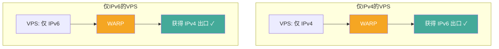
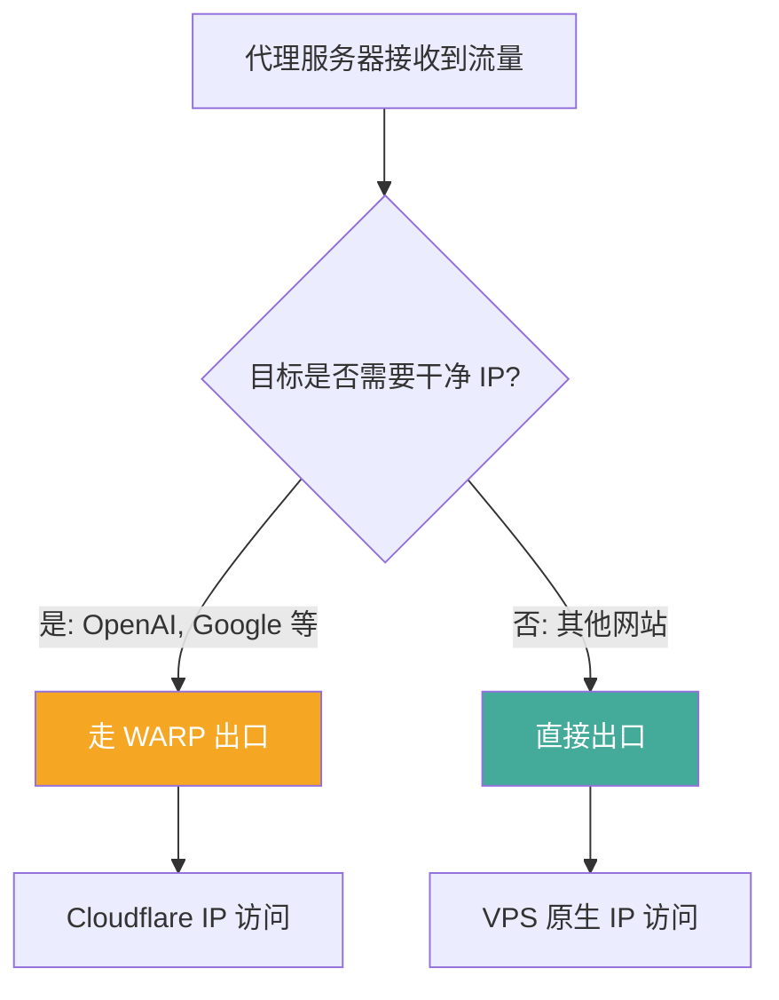

> **摘要**：Cloudflare WARP 是 Cloudflare 推出的免费加密网络服务，基于 WireGuard 协议构建。它本身不是传统意义上的代理工具，但在代理生态中扮演着非常重要的角色——通过将代理出口流量接入 Cloudflare 的全球网络，可以实现获取干净 IP、解锁特定服务、IPv4/IPv6 互转等功能。本文详细解析 WARP 的技术原理、常见用途、部署方法以及与 WireGuard 的关系。

## WireGuard 协议简介

在讨论 WARP 之前，有必要先理解它的底层协议——WireGuard。

WireGuard 是一种现代化的 VPN 隧道协议，由 Jason Donenfeld 于 2017 年设计，2020 年正式合并进入 Linux 内核。与 OpenVPN 和 IPSec 相比，WireGuard 的设计哲学是**极简**：

| 对比维度 | WireGuard | OpenVPN | IPSec/IKEv2 |
|---------|-----------|---------|-------------|
| 代码行数 | ~4,000 行 | ~100,000 行 | ~400,000 行 |
| 加密套件 | 固定（Noise 框架） | 可配置（OpenSSL） | 可协商 |
| 握手速度 | 1-RTT | 多次往返 | 多次往返 |
| 协议层 | 内核层（UDP） | 用户层（TCP/UDP） | 内核层 |
| 配置复杂度 | 极低 | 中等 | 高 |
| 性能 | 极高 | 中等 | 高 |

WireGuard 使用 **Noise 协议框架**进行密钥交换，默认使用 Curve25519（密钥交换）、ChaCha20-Poly1305（数据加密）、BLAKE2s（哈希），不支持也不需要协商——所有节点使用相同的加密套件。这种"不可配置"的设计消除了因配置不当导致的安全隐患。

### WireGuard 的核心概念

WireGuard 的配置围绕几个核心概念：

- **Interface**：本地隧道接口，包含私钥和监听端口
- **Peer**：对端节点，包含公钥、允许的 IP 范围（AllowedIPs）和端点地址
- **AllowedIPs**：决定哪些流量通过隧道传输，相当于路由规则

一个最简配置：

```ini
[Interface]
PrivateKey = <your-private-key>
Address = 172.16.0.2/32
DNS = 1.1.1.1

[Peer]
PublicKey = <server-public-key>
Endpoint = server-ip:51820
AllowedIPs = 0.0.0.0/0, ::/0
```

`AllowedIPs = 0.0.0.0/0, ::/0` 表示所有 IPv4 和 IPv6 流量都通过隧道——这就是全局代理模式。

## Cloudflare WARP 是什么

Cloudflare WARP 是 Cloudflare 在 WireGuard 协议基础上构建的网络服务。它有几个不同的产品形态：

### WARP 客户端（1.1.1.1 App）

面向终端用户的免费 VPN 应用，支持 Windows、macOS、Linux、iOS、Android。默认将用户的 DNS 查询发送到 Cloudflare 的 1.1.1.1 DNS，并通过 WireGuard 隧道加密所有网络流量。

### WARP+

WARP 的付费版本，使用 Cloudflare 的 Argo 智能路由技术，通过优化的网络路径传输流量，提供更低的延迟和更高的速度。

### Zero Trust（Cloudflare One）

企业级产品，将 WARP 与访问控制、设备管理、DLP 等安全功能集成，用于替代传统的企业 VPN。

### WARP 在代理场景中的角色

在代理生态中，WARP 最常见的用途**不是**作为客户端翻墙工具（它的速度和稳定性不足以胜任），而是作为**服务器端的出口优化工具**。具体来说：


代理服务器通过 WARP 隧道将出口流量接入 Cloudflare 的全球网络，获得一个 Cloudflare 分配的 IP 地址。这个 IP 地址通常比 VPS 原生 IP 更"干净"（信誉更高），且自带 IPv6 支持。

## 为什么需要 WARP

### 获取干净 IP

很多 VPS 的 IP 地址由于被大量代理用户使用，已经被各种服务列入了灰名单或黑名单。通过 WARP 将出口流量转发到 Cloudflare 网络，等于换了一个 Cloudflare 的 IP 地址——这些 IP 被数百万正常用户使用，信誉度极高。

**典型场景**：
- ChatGPT、New Bing 等 AI 服务封锁了大量 VPS IP 段，接入 WARP 后可以正常访问
- Google 搜索频繁弹出人机验证，接入 WARP 后明显减少
- 某些网站的反爬机制将 VPS IP 视为高风险来源

### IPv4/IPv6 互转

很多廉价 VPS 只有 IPv4 地址没有 IPv6，或者只有 IPv6 没有 IPv4。WARP 提供双栈支持——无论你的 VPS 原始网络是什么，接入 WARP 后都同时拥有 IPv4 和 IPv6 出口。



### 解锁特定服务

某些流媒体和网络服务会根据 IP 的归属来决定是否提供服务。WARP 分配的 IP 属于 Cloudflare（AS13335），通常可以解锁以下服务：

- **ChatGPT / OpenAI**：对 WARP IP 比较友好
- **Google 学术**：减少人机验证
- **部分流媒体**：取决于 WARP 分配到的 IP 所在区域

但需要注意，WARP IP 并不能解锁所有服务——Netflix、Disney+ 等主流流媒体通常会检测并封锁已知的 Cloudflare IP 段。

### 绕过目标站的 IP 封锁

如果你的 VPS IP 被某个目标站封锁，通过 WARP 出口可以换一个 IP 继续访问。这在 VPS IP 被 Google、OpenAI 等服务封锁时特别有用。

## 部署方式

在代理服务器上部署 WARP 有多种方式，以下按推荐顺序介绍。

### 方式一：fscarmen/warp 一键脚本（推荐）

[fscarmen/warp](https://gitlab.com/fscarmen/warp) 是目前最流行、最好用的 WARP 一键部署脚本。它支持多种 Linux 发行版，自动处理依赖安装、WireGuard 内核模块加载、WARP 账户注册等复杂操作。

```bash
# 下载并运行脚本
wget -N https://gitlab.com/fscarmen/warp/-/raw/main/menu.sh && bash menu.sh
```

脚本提供交互式菜单，支持以下功能：

- **WARP 模式选择**：WireGuard 模式（内核级）、WARP-GO 模式（用户态）、WARP Client 模式
- **双栈配置**：IPv4 only、IPv6 only、双栈
- **WARP+ 账户**：支持输入 WARP+ License Key 获得更好的速度
- **自动检测**：自动识别系统环境和网络状况，选择最佳方案

**常用操作**：

```bash
# 安装 WARP 双栈（IPv4 + IPv6）
bash menu.sh 4

# 仅安装 IPv6 WARP（给仅 IPv4 的 VPS 添加 IPv6 出口）
bash menu.sh 6

# 仅安装 IPv4 WARP（给仅 IPv6 的 VPS 添加 IPv4 出口）
bash menu.sh 4

# 查看 WARP 状态
bash menu.sh s

# 卸载 WARP
bash menu.sh u
```

**为什么推荐这个脚本**：

1. 维护活跃，持续跟进 Cloudflare WARP 的变化
2. 支持几乎所有主流 Linux 发行版（Debian、Ubuntu、CentOS、Alpine、Arch 等）
3. 自动处理 VPS 虚拟化环境差异（KVM、OpenVZ、LXC 等）
4. 提供 WireGuard 和 WARP-GO 双方案——如果内核不支持 WireGuard 模块，自动切换到用户态方案
5. 交互式菜单 + 命令行参数，适合新手和老手

### 方式二：手动配置 WireGuard

如果你更喜欢手动控制，可以直接使用 WireGuard 连接 Cloudflare WARP 网络。

**步骤 1：注册 WARP 账户获取配置**

可以使用 [warp-reg](https://github.com/badafans/warp-reg) 等工具注册 WARP 账户并获取 WireGuard 配置参数：

```bash
# 使用 warp-reg 注册账户
./warp-reg
```

注册后会获得私钥、对端公钥、IPv4/IPv6 地址和端点信息。

**步骤 2：配置 WireGuard**

```ini
[Interface]
PrivateKey = <从注册结果获取>
Address = 172.16.0.2/32, fd01:5ca1:ab1e:xxxx:xxxx:xxxx:xxxx:xxxx/128
DNS = 1.1.1.1
MTU = 1280

[Peer]
PublicKey = bmXOC+F1FxEMF9dyiK2H5/1SUtzH0JuVo51h2wPfgyo=
AllowedIPs = 0.0.0.0/0, ::/0
Endpoint = engage.cloudflareclient.com:2408
```

**步骤 3：启动并配置路由**

```bash
# 启动 WireGuard
wg-quick up warp

# 查看状态
wg show
```

### 方式三：WARP-GO（用户态方案）

对于不支持 WireGuard 内核模块的 VPS（如某些 OpenVZ 虚拟化），可以使用 Cloudflare 的 WARP-GO 用户态实现。fscarmen/warp 脚本会自动检测并在需要时使用这种方案。

## 代理软件集成 WARP

### Xray-core 出站配置

在 Xray-core 中，可以通过配置出站规则将特定流量路由到 WARP 接口：

```json
{
  "outbounds": [
    {
      "protocol": "freedom",
      "tag": "direct",
      "settings": {}
    },
    {
      "protocol": "freedom",
      "tag": "warp",
      "settings": {
        "domainStrategy": "UseIPv6"
      },
      "streamSettings": {
        "sockopt": {
          "interface": "warp"
        }
      }
    }
  ],
  "routing": {
    "rules": [
      {
        "type": "field",
        "domain": [
          "openai.com",
          "chat.openai.com",
          "ai.com"
        ],
        "outboundTag": "warp"
      },
      {
        "type": "field",
        "domain": [
          "google.com",
          "googleapis.com"
        ],
        "outboundTag": "warp"
      }
    ]
  }
}
```

这个配置的含义是：访问 OpenAI 和 Google 的流量通过 WARP 接口出去（获得 Cloudflare IP），其他流量直连。

### sing-box 出站配置

```json
{
  "outbounds": [
    {
      "type": "direct",
      "tag": "direct"
    },
    {
      "type": "direct",
      "tag": "warp-out",
      "bind_interface": "warp",
      "inet6_bind_address": "::"
    }
  ],
  "route": {
    "rules": [
      {
        "domain_suffix": ["openai.com", "ai.com"],
        "outbound": "warp-out"
      }
    ]
  }
}
```

### WireGuard 出站（无需系统级 WARP）

sing-box 和 Xray-core 都支持内置 WireGuard 出站，可以不在系统层面安装 WARP，而是直接在代理软件内部建立 WireGuard 隧道连接 Cloudflare：

**sing-box WireGuard 出站示例**：

```json
{
  "type": "wireguard",
  "tag": "warp-wg",
  "server": "engage.cloudflareclient.com",
  "server_port": 2408,
  "local_address": [
    "172.16.0.2/32",
    "fd01:5ca1:ab1e:xxxx::/128"
  ],
  "private_key": "<your-private-key>",
  "peer_public_key": "bmXOC+F1FxEMF9dyiK2H5/1SUtzH0JuVo51h2wPfgyo=",
  "mtu": 1280
}
```

这种方式的优势是不依赖系统 WireGuard 支持，缺点是性能略低于内核级方案。

## WARP 链式代理（Warp-in-Warp）

在某些极端场景下，单层 WARP 分配的 IP 仍然不满足需求（比如被分配到了一个信誉不好的 Cloudflare IP 段）。这时可以使用 WARP 链式代理——在 WARP 连接之上再套一层 WARP，获取不同的出口 IP：


fscarmen/warp 脚本支持这种配置。但一般情况下，单层 WARP 已经足够，链式方案仅在特殊需求时使用。

## WARP 的局限性

### 不适合直接翻墙

WARP 不是翻墙工具。虽然它提供加密隧道，但 Cloudflare 的 WARP 端点（engage.cloudflareclient.com）在中国大陆的连通性很差。直接使用 WARP 客户端在大陆通常无法正常工作或速度极慢。WARP 的正确用法是在海外代理服务器上使用，而不是在客户端使用。

### IP 地址不固定

WARP 分配的 IP 地址可能会变化，且无法指定特定地区的 IP。如果需要稳定的特定地区 IP（如日本 IP 解锁日区服务），WARP 不是最佳选择。

### 流媒体解锁能力有限

Cloudflare IP 被大量用户共享，Netflix、Disney+ 等主流流媒体服务已经将大部分 Cloudflare IP 段列入封锁名单。WARP 主要适合解锁 AI 服务（ChatGPT 等），对流媒体解锁效果有限。

### 增加一跳延迟

通过 WARP 出口的流量多了一跳——从代理服务器到 Cloudflare 网络。这会增加 10-30ms 的延迟。对延迟敏感的场景应该选择性使用 WARP（只对需要的流量启用），而不是全局走 WARP。

## WARP 与代理搭配的最佳实践

### 精确分流

不要将所有流量都走 WARP。通过代理软件的路由规则，只让需要干净 IP 的流量（如 AI 服务、Google 等）走 WARP，其他流量直连：



### 定期检查 WARP 状态

WARP 连接可能因为各种原因断开。建议设置一个定时任务检查 WARP 状态：

```bash
# 检查 WARP 是否正常（crontab 每 5 分钟检查一次）
*/5 * * * * ping -c 2 -W 3 -I warp 1.1.1.1 > /dev/null 2>&1 || (wg-quick down warp && wg-quick up warp)
```

### 合理选择 WARP 端点

Cloudflare WARP 有多个端点地址和端口可选：

| 端点 | 端口 |
|------|------|
| engage.cloudflareclient.com | 2408 |
| 162.159.193.1 | 2408, 500, 1701, 4500 |
| 162.159.192.1 | 2408, 500, 1701, 4500 |
| [2606:4700:d0::a29f:c001] | 2408 |
| [2606:4700:d1::a29f:c101] | 2408 |

如果默认端点连接不稳定，可以尝试其他端点或端口。

## 常见问题

### Q: WARP 和代理服务器同时使用会冲突吗？

通常不会，但需要正确配置路由规则。关键是确保代理服务器本身的入站流量不走 WARP——只有出站到特定目标的流量才走 WARP。fscarmen/warp 脚本在安装时会自动处理路由配置，避免"把自己锁在外面"的情况。

### Q: WARP 和 WARP+ 有多大区别？

对于代理服务器出口使用场景，差别不大。WARP+ 的 Argo 智能路由主要优化客户端到 Cloudflare 网络的路径，而代理服务器通常本身网络条件就不错。免费 WARP 足以满足大多数需求。

### Q: 为什么安装 WARP 后 SSH 断开了？

这通常是因为 WARP 的路由规则覆盖了 SSH 连接的路由。fscarmen/warp 脚本会自动处理这个问题，但如果手动安装，需要确保 SSH 流量不通过 WARP 隧道。解决方法是在 WireGuard 配置中排除 SSH 相关的 IP。

### Q: OpenVZ/LXC 虚拟化的 VPS 能用 WARP 吗？

可以。虽然 OpenVZ/LXC 不支持加载内核模块（因此不能使用内核 WireGuard），但可以使用 WARP-GO 或 wireguard-go 等用户态方案。fscarmen/warp 脚本会自动检测虚拟化类型并选择合适的方案。

## 相关链接

- [fscarmen/warp](https://gitlab.com/fscarmen/warp) — 最好用的 WARP 一键部署脚本
- [Cloudflare WARP 官方页面](https://1.1.1.1/) — WARP 客户端下载
- [WireGuard 官方网站](https://www.wireguard.com/) — WireGuard 协议文档
- [Xray-core](https://github.com/XTLS/Xray-core) — 支持 WireGuard 出站的代理内核
- [sing-box](https://github.com/SagerNet/sing-box) — 支持 WireGuard 出站的代理内核

---

*WARP 本身不是翻墙工具，但它是代理工具链中一个非常有用的"辅助件"——用对了场景，能显著提升代理体验。*
