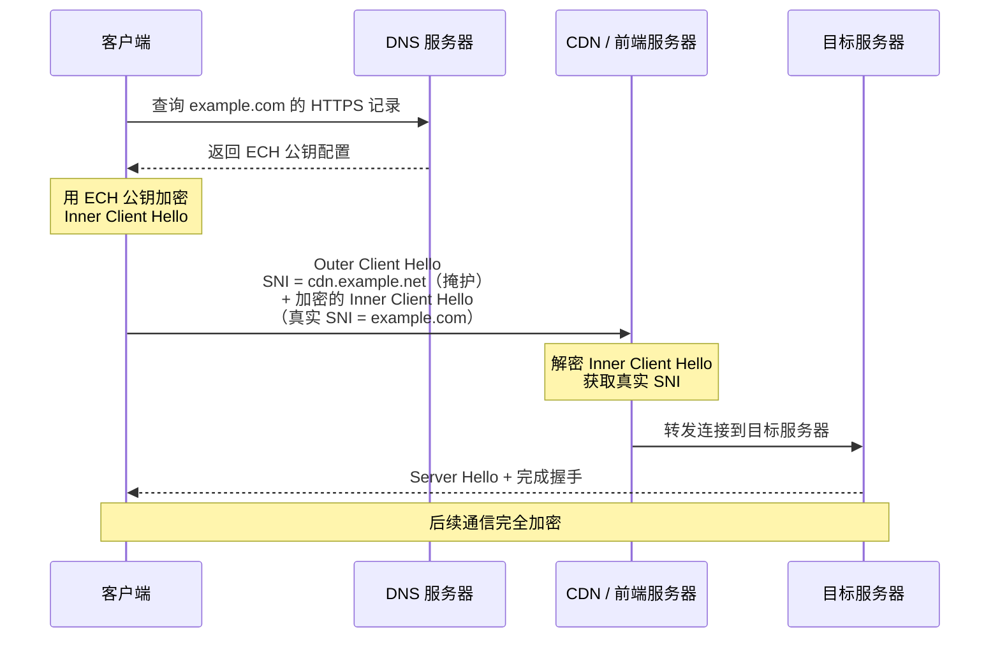

> **摘要**：TLS 握手中的 SNI 字段是明文传输的，GFW 正是利用它来判断你访问的是什么网站。ECH（Encrypted Client Hello）旨在加密整个 Client Hello 的敏感部分，从协议层面消除 SNI 暴露。然而，GFW 已经开始直接封锁带有 ECH 扩展的连接。本文分析 ECH 的工作原理、GFW 的应对手段、ECH 与 Reality 的路线差异，以及 ECH 真正发挥作用所需要的条件。

## SNI 暴露问题：TLS 握手的阿喀琉斯之踵

TLS 协议的设计目标是保护通信内容不被窃听和篡改。在 TLS 1.3 中，握手完成后的所有数据都是加密的，外部观察者无法读取任何应用层内容。但问题出在握手过程本身。

在 TLS 握手的第一步，客户端向服务器发送 **Client Hello** 消息。这条消息包含了大量连接参数，其中有一个关键字段叫做 **SNI（Server Name Indication）**。SNI 的作用是告诉服务器"我想连接的是哪个域名"，这在同一 IP 上托管多个域名的场景下是必要的——服务器需要根据域名来选择正确的 TLS 证书。

问题在于：**SNI 字段是以明文发送的**。

这意味着任何处于网络路径上的中间设备（ISP、防火墙、GFW）都可以直接读取你要访问的域名，即使后续的所有通信内容都是加密的。对于 GFW 来说，这是一个极其方便的审查点：

- 不需要解密任何内容，只需要读取握手阶段的明文字段
- 可以精准地按域名进行过滤和封锁
- 对性能的影响极小，适合大规模部署

实际上，SNI 过滤已经是 GFW 封锁特定网站的主要手段之一。当你尝试与一个被封锁的域名建立 TLS 连接时，GFW 会在读取到 SNI 后主动发送 RST 包来中断连接。

这就是整个问题的根源：**TLS 保护了通信内容，却没有保护"你要和谁通信"这个事实**。

## ECH 是什么

**ECH（Encrypted Client Hello）** 是 IETF 正在推进的一项 TLS 扩展标准，编号为 `draft-ietf-tls-esni`。它的前身是 ESNI（Encrypted SNI），但 ESNI 只加密了 SNI 一个字段，设计上存在局限性。ECH 将加密范围扩大到了整个 Client Hello 的敏感部分，是 ESNI 的全面升级。

ECH 的核心目标只有一个：**让网络中间设备无法从 TLS 握手中获取连接目标的信息**。

具体来说，ECH 将原本单一的 Client Hello 拆分成两层：

- **外层（Outer Client Hello）**：以明文发送，包含一个"掩护"用的 SNI，通常指向 CDN 的域名
- **内层（Inner Client Hello）**：被加密，包含真实的 SNI 和其他敏感握手参数

这样一来，中间设备只能看到外层的掩护域名，无法得知客户端实际要连接的是哪个网站。

## 工作原理：双层 Client Hello

ECH 的运作依赖于一个预先分发的公钥。整个流程如下：

### 密钥获取

客户端在发起 TLS 连接之前，需要通过 **DNS HTTPS 记录**（也叫 SVCB 记录）获取目标域名的 ECH 配置，其中包含服务器的 ECH 公钥。这个公钥用于加密内层 Client Hello。

例如，查询 `example.com` 的 DNS HTTPS 记录，可能会返回类似这样的信息：

```
example.com.  IN HTTPS 1 . alpn="h2" ech="AEX+..."
```

其中 `ech=` 字段就包含了 ECH 的公钥配置。

### 握手流程



以上流程的关键点：

1. **外层 SNI 是掩护**：中间设备看到的 SNI 是 CDN 的域名（如 `cdn.example.net`），而不是真实的目标域名
2. **内层被加密**：真实的 SNI 和其他敏感参数被 ECH 公钥加密，只有前端服务器能解密
3. **依赖 DNS**：ECH 公钥通过 DNS HTTPS 记录分发，因此也需要加密 DNS（如 DoH/DoT）来防止公钥被篡改或窃取

## 浏览器支持

截至目前，主流浏览器对 ECH 的支持情况如下：

| 浏览器 | ECH 支持状态 |
|--------|-------------|
| Firefox | 自 Firefox 118 起默认启用 ECH（需要启用 DoH） |
| Chrome | 自 Chrome 117 起支持 ECH（需要启用安全 DNS） |
| Safari | 部分版本中开始实验性支持 |
| Edge | 跟随 Chromium 内核，支持与 Chrome 基本一致 |

需要注意的是，浏览器启用 ECH 有一个**前提条件**：必须同时使用加密 DNS（DoH 或 DoT）。这很好理解——如果 DNS 查询本身是明文的，攻击者可以直接从 DNS 响应中获取 ECH 配置，或者篡改 DNS 返回结果来移除 ECH 公钥。

此外，服务端也需要支持 ECH。目前 **Cloudflare** 是最积极的推动者，已经为其平台上托管的所有域名默认启用了 ECH 支持。

## GFW 的应对：直接封锁 ECH

既然 ECH 的目的是隐藏 SNI，GFW 的对策非常直接——**检测到 ECH 扩展，就封锁整个连接**。

ECH 在 TLS 协议中以一个特定的 **TLS 扩展**形式存在，扩展类型编号为 `0xfe0d`（十进制 65037）。这个扩展出现在 Client Hello 的扩展列表中，而扩展列表本身是明文的。这意味着：

- GFW 不需要解密任何内容
- 只需要检查 Client Hello 的扩展列表中是否包含 `0xfe0d` 类型的扩展
- 一旦检测到，直接丢弃数据包或发送 RST 中断连接

实测表明，GFW 确实在实施这种封锁策略。使用启用了 ECH 的浏览器访问 Cloudflare 托管的网站时，如果 DNS 返回了 ECH 配置，浏览器会尝试使用 ECH 握手，而这些连接会被 GFW 阻断。浏览器在 ECH 握手失败后通常会回退到普通的 TLS 握手（不带 ECH），此时连接可以成功建立，但 SNI 又暴露了。

## 为什么 GFW 能封 ECH

有人可能会问：ECH 不是把内层加密了吗？为什么 GFW 还是能检测和封锁？

原因在于 ECH 有两个无法隐藏的特征：

### 1. ECH 扩展标识本身是明文的

TLS Client Hello 的格式是固定的：先是协议版本、随机数、加密套件列表，然后是扩展列表。每个扩展都有一个类型编号和长度，这些元数据是明文的。ECH 扩展的类型编号 `0xfe0d` 就像一面旗帜，告诉所有中间设备"这个连接正在使用 ECH"。

ECH 加密的是扩展的**内容**（即内层 Client Hello），而不是扩展的**存在性**。

### 2. 外层与内层 SNI 的差异

即使不看扩展标识，外层 Client Hello 的 SNI 指向 CDN 域名本身就是一个可检测的特征。GFW 可以通过以下方式进行关联分析：

- 外层 SNI 指向的 CDN 域名通常是少数几个固定的值
- 大量不同用户的连接都使用相同的外层 SNI，但来自不同的 IP 地址
- 这种流量模式与正常的 CDN 访问有可辨别的差异

总结一下：**ECH 加密了 SNI 的内容，但无法隐藏自己正在使用 ECH 的事实**。在当前阶段，使用 ECH 本身就是一个可被检测和封锁的特征。

## ECH vs Reality：两条不同的技术路线

ECH 和 VLESS+Reality 都在尝试解决 SNI 暴露的问题，但思路完全不同。

| 对比维度 | ECH | Reality |
|---------|-----|---------|
| 方法论 | 正面解决：加密 SNI | 侧面绕过：借用合法网站的证书和 SNI |
| 标准化 | IETF 标准草案，主流浏览器支持 | 非标准，代理社区自研 |
| 是否依赖 CDN | 是，需要 CDN 支持 ECH | 否，独立运行 |
| GFW 可检测性 | 高：ECH 扩展明确可识别 | 低：流量与正常 HTTPS 几乎无法区分 |
| 适用场景 | 通用的隐私保护 | 专门的审查规避 |
| 部署方式 | 浏览器 + 服务端 + 加密 DNS | 代理客户端 + 代理服务端 |

**ECH 是"正面突破"**：它试图通过加密来从根本上消除 SNI 暴露，是一种协议层面的解决方案。它的目标不仅仅是绕过审查，而是保护所有用户的连接隐私。

**Reality 是"侧面迂回"**：它不依赖 ECH，而是让代理服务器伪装成一个完全合法的 HTTPS 网站。代理连接的 SNI 填写的就是那个合法网站的域名，TLS 握手中使用的也是那个网站的真实证书。GFW 看到的是一个完全正常的 HTTPS 连接，没有任何异常特征。

在当前 GFW 已经封锁 ECH 的情况下，Reality 的实用性显然更强。但从长远来看，ECH 如果能普及，将从根本上改变格局。

## 未来展望：当 ECH 变成默认行为

ECH 目前面临的困境是一个典型的**先有鸡还是先有蛋**的问题：

- ECH 用户太少 → GFW 可以直接封锁 ECH 而不影响正常流量
- GFW 封锁 ECH → 更少的用户能使用 ECH
- 更少的用户使用 ECH → ECH 推广更加困难

但这个僵局有一个理论上的破解点：**如果 ECH 成为 TLS 标准的默认行为**。

设想一个未来场景：所有主流浏览器默认启用 ECH，所有主流 CDN 和网站服务器默认支持 ECH，所有 TLS 连接都携带 ECH 扩展。在这种情况下：

- **封锁 ECH = 封锁所有 HTTPS 连接**
- 这将导致整个互联网的 HTTPS 通信中断
- GFW 无法承受这样的代价

这就像 HTTPS 本身的普及历程。在早期，HTTPS 只有银行和电商网站使用，如果当时封锁 HTTPS，影响范围有限。但当 HTTPS 成为所有网站的默认选项后，封锁 HTTPS 就等于封锁整个互联网——这是任何审查系统都无法接受的代价。

ECH 需要走同样的路。从"少数网站支持的可选功能"变成"所有网站默认启用的标准行为"。

### 但这需要很长时间

ECH 的全面普及面临多个现实障碍：

1. **标准尚未最终确定**：`draft-ietf-tls-esni` 仍然是草案状态，虽然已经接近完成，但正式成为 RFC 还需要时间
2. **服务端部署缓慢**：除了 Cloudflare，其他 CDN 和服务提供商对 ECH 的支持进度参差不齐
3. **加密 DNS 是前提**：ECH 需要 DoH/DoT 配合才有意义，而加密 DNS 本身在很多地区也面临限制
4. **企业网络阻力**：很多企业依赖 SNI 来进行流量审查和安全监控，它们可能不愿意放弃这个能力
5. **兼容性问题**：一些老旧的中间设备（防火墙、负载均衡器）可能无法正确处理 ECH 扩展，导致连接失败

乐观估计，ECH 成为 TLS 生态的默认行为可能需要**数年时间**。在这段过渡期内，ECH 对于审查规避的实际作用有限。

## 常见问题

### ECH 和 ESNI 有什么区别？

ESNI（Encrypted SNI）是 ECH 的前身，只加密了 Client Hello 中的 SNI 字段。ECH 是全面升级，加密了整个 Client Hello 的内层，包括 SNI、ALPN 等所有敏感参数。ESNI 已经被废弃，由 ECH 取代。

### 为什么 ECH 需要加密 DNS？

ECH 的公钥通过 DNS HTTPS 记录分发。如果 DNS 查询是明文的，GFW 可以：(1) 读取 DNS 响应获知你要访问的域名；(2) 篡改 DNS 响应移除 ECH 公钥，使客户端无法使用 ECH。因此必须配合 DoH 或 DoT 使用。

### 现在使用 ECH 能绕过 GFW 吗？

不能。GFW 已经在检测并封锁带有 ECH 扩展的 TLS 连接。使用 ECH 不但不能绕过审查，反而会因为连接被阻断而导致访问失败。浏览器通常会在 ECH 失败后回退到普通 TLS，此时 SNI 仍然是暴露的。

### ECH 对日常隐私有帮助吗？

在不存在主动审查封锁的网络环境中，ECH 确实能有效防止 ISP 和其他中间设备通过 SNI 监控你的访问目标。对于关注隐私的用户来说，ECH + 加密 DNS 是有意义的组合。

### Reality 协议未来会被 ECH 取代吗？

短期内不会。两者解决的问题有交集但不完全相同。ECH 是通用的隐私保护标准，Reality 是专门针对审查规避设计的方案。即使 ECH 完全普及，代理协议仍然有其存在价值，只是在对抗 SNI 暴露这个具体问题上，ECH 可能会让 Reality 的这一优势变得不那么关键。

## 延伸阅读

- [ECH 标准草案（draft-ietf-tls-esni）](https://datatracker.ietf.org/doc/draft-ietf-tls-esni/)
- [Cloudflare ECH 介绍博客](https://blog.cloudflare.com/encrypted-client-hello/)
- [REALITY 项目](https://github.com/XTLS/REALITY)
