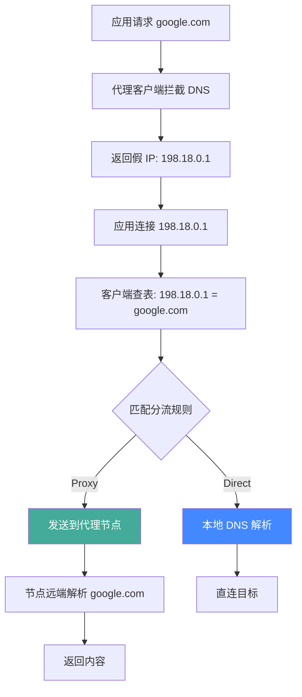

> **摘要**：Fake-IP 和 Redir-Host 是代理客户端处理 DNS 的两种模式。选错模式或配置不当是代理使用中最常见的问题来源。本文用通俗的语言彻底讲清两者的原理、区别和选择。

## 先说结论

- 2026 年，绝大多数用户应该使用 Fake-IP 模式
- Redir-Host 仍有存在价值，但适用场景很少
- 网上大量过时教程仍在推荐 Redir-Host + fallback 的配置，这在 Fake-IP 时代是错误的

如果你只想知道"我该用哪个"，答案就是 Fake-IP。如果你想知道为什么，继续往下读。

## 为什么 DNS 模式这么重要

在代理客户端中，DNS 模式决定了一个根本性的问题：**客户端在什么时候、以什么方式进行 DNS 解析。** 这个决定直接影响三件事：

1. **连接速度**——DNS 解析越快，网页打开越快
2. **隐私安全**——DNS 请求如果泄漏，你的 ISP（网络运营商）和 GFW 就知道你在访问什么
3. **路由准确性**——规则匹配的依据是域名还是 IP，直接决定流量能否被正确分流

理解这两种模式之前，先回顾一个基础知识：**DNS 解析就是把域名（如 google.com）翻译成 IP 地址（如 142.250.80.46）。** 任何网络连接都必须知道目标 IP 才能建立。所以不管用哪种模式，DNS 解析这一步都无法跳过——区别只在于谁来做、什么时候做。

> 如果你对 DNS 的基础概念不太熟悉，建议先阅读 [DNS 基础：为什么代理和 DNS 总是一起出问题](./dns-basics-for-proxy.md)。

## Fake-IP 模式详解

### 核心思路

Fake-IP 的核心设计思路只有一句话：**先不做真正的 DNS 解析，给应用一个假 IP 占位，等确定了路由策略后再决定是否需要真正解析。**

这个"延迟解析"的策略，直接绕开了传统 DNS 面临的大部分问题。

### 工作流程：代理域名

当你访问一个需要走代理的域名（如 google.com）时，Fake-IP 模式的处理流程如下：

1. 浏览器想访问 google.com，向操作系统发起 DNS 查询请求
2. 代理客户端拦截这个 DNS 请求（因为客户端接管了系统 DNS）
3. 客户端**不会**真正去解析 google.com，而是从预设的假 IP 段中分配一个地址，比如 `198.18.0.1`
4. 客户端在内部维护一张映射表，记录下：`198.18.0.1 = google.com`
5. 浏览器收到 `198.18.0.1` 这个"解析结果"，认为 google.com 就在这个地址，于是发起 TCP 连接
6. 代理客户端再次拦截这个连接请求，查映射表发现 `198.18.0.1` 对应的是 google.com
7. 客户端拿 google.com 去匹配分流规则，命中规则：google.com → Proxy（走代理）
8. 客户端将域名 google.com 发送给远端代理节点，由节点在境外进行真正的 DNS 解析并获取内容
9. 内容通过加密通道返回给你

注意关键点：**从头到尾，google.com 的真实 DNS 解析从未在你的本地设备上发生。** 你的 ISP 和 GFW 完全不知道你查询了 google.com——因为你确实没有查询过。




### 工作流程：直连域名

当你访问一个直连域名（如 baidu.com）时，流程有所不同：

1. 浏览器想访问 baidu.com，向操作系统发起 DNS 查询请求
2. 代理客户端拦截 DNS 请求
3. 客户端返回假 IP，比如 `198.18.0.2`
4. 客户端记录：`198.18.0.2 = baidu.com`
5. 浏览器发起对 `198.18.0.2` 的 TCP 连接
6. 客户端拦截连接，查映射表找到 baidu.com
7. 客户端匹配分流规则：baidu.com → Direct（直连）
8. **此时**客户端才用配置的国内 DNS（如腾讯 DoH、阿里 DoH）去真正解析 baidu.com，获取真实 IP
9. 客户端建立到真实 IP 的直接连接

关键点：**真实 DNS 解析发生在路由决策之后。** 只有确认需要直连的域名，才会触发本地 DNS 查询。这意味着 `nameserver` 里配置的 DNS 服务器只会收到国内域名的查询请求——这正是我们想要的结果。

### 关键优势

**彻底杜绝 DNS 泄漏。** 走代理的域名从不在本地解析，DNS 查询只发生在远端代理节点所在的网络。你的 ISP 和 GFW 看不到任何关于这些域名的 DNS 请求。在 Redir-Host 模式下，即使最终走了代理，DNS 查询本身已经暴露了你的访问意图。

**速度极快。** DNS 请求在本地瞬间返回一个假 IP，没有任何网络往返。应用几乎感受不到 DNS 延迟。相比之下，Redir-Host 需要等待真实 DNS 查询完成（通常几十到几百毫秒），如果配置了 fallback，还要等待多个 DNS 服务器的响应并进行比较。

**规则匹配基于域名，极其准确。** 客户端拿到的是原始域名 google.com，直接与分流规则中的域名规则（如 `DOMAIN-SUFFIX,google.com`）进行匹配。域名是确定的、不会被篡改的。而 Redir-Host 依赖 IP 进行匹配（如 `GEOIP,CN`），IP 的归属可能不准确，CDN 的 IP 可能随时变化。

**配置简单。** 不需要 fallback、不需要 fallback-filter、不需要担心 DNS 污染。只要在 nameserver 中配置可靠的国内 DNS 就够了。

### Fake-IP 地址范围

Fake-IP 使用的地址范围默认是 `198.18.0.0/15`（即 `198.18.0.0` 到 `198.19.255.255`），在大多数客户端的配置中写作 `198.18.0.1/16`。

这个地址段是 IANA（互联网号码分配机构）保留的基准测试地址段，在真实互联网上永远不会被使用。这意味着：

- 这些 IP 只存在于你本地设备和代理客户端之间
- 不会和任何真实的网络地址冲突
- 永远不会被路由到互联网上
- 对你的局域网也没有任何影响

你不需要修改这个默认值，除非你的网络环境极其特殊（比如你的内网恰好使用了 198.18 段——这几乎不可能发生）。

### fake-ip-filter 是什么

虽然 Fake-IP 模式适用于绝大多数场景，但确实存在一些服务需要获得真实 IP 地址才能正常工作。`fake-ip-filter` 就是告诉客户端：**对于这些域名，不要返回假 IP，而是进行真实的 DNS 解析并返回真实 IP。**

需要加入 fake-ip-filter 的典型场景：

**局域网设备发现。** mDNS、SSDP 等协议用于局域网内设备的自动发现（如打印机、NAS、智能音箱）。这些协议依赖真实的局域网 IP 地址来建立设备间的连接。如果返回一个 `198.18.x.x` 的假地址，设备发现会完全失败。需要过滤的域名包括 `*.lan`、`*.local`、`*.localhost`。

**Windows 网络连接检测。** Windows 系统通过访问特定域名来判断当前是否有互联网连接（系统托盘的网络图标会据此显示"已连接"或"无 Internet 连接"）。如果这些域名返回假 IP，Windows 可能误判为没有网络连接。需要过滤的域名包括 `*.msftconnecttest.com`、`dns.msftncsi.com`。

**NTP 时间同步。** 系统时间同步服务需要连接到真实的 NTP 服务器。如果返回假 IP，时间同步会失败，可能导致 TLS 证书验证出错（证书有有效期，时间不准就无法正确验证）。需要过滤的域名包括 `time.*.com`、`ntp.*.com`。

**STUN 协议。** WebRTC（视频通话、语音聊天）和部分 VoIP 服务使用 STUN 服务器来发现自己的公网 IP 和 NAT 类型。如果 STUN 服务器的域名返回假 IP，NAT 穿透会失败，导致通话无法建立。需要过滤的域名包括 `+.stun.*.*`。

**部分游戏。** 少数在线游戏的联机系统（尤其是 P2P 模式的游戏）需要知道真实 IP 来建立玩家间的直接连接。如果你发现某个游戏联机有问题，可以尝试把它的相关域名加入 fake-ip-filter。

一个典型的 fake-ip-filter 配置：

```yaml
fake-ip-filter:
  - '*.lan'
  - '*.local'
  - '*.localhost'
  - 'dns.msftncsi.com'
  - 'www.msftncsi.com'
  - '*.msftconnecttest.com'
  - 'time.*.com'
  - 'ntp.*.com'
  - '+.stun.*.*'
  - '+.stun.*.*.*'
  - 'localhost.ptlogin2.qq.com'
  - 'lens.l.google.com'
```

## Redir-Host 模式详解

### 核心思路

Redir-Host 的逻辑是传统思路：**先做真实的 DNS 解析，拿到 IP 之后再决定路由。**

这个思路看似直观，但在中国大陆的网络环境下会遇到一个根本性问题：DNS 污染。

### 工作流程

1. 浏览器想访问 google.com，发起 DNS 查询
2. 代理客户端拦截 DNS 请求
3. 客户端**真正去解析** google.com——向配置的 DNS 服务器发送查询
4. 这里出现第一个问题：如果使用国内 DNS（如 114.114.114.114），GFW 会拦截查询并返回一个被污染的假 IP
5. 为了解决这个问题，Redir-Host 模式引入了 **fallback 机制**：同时向 nameserver（通常是国内 DNS）和 fallback（通常是海外 DNS，如 Google 的 DoH）发送查询
6. 客户端收到两边的结果后，使用 fallback-filter 规则进行比较：
   - 如果 nameserver 返回的 IP 经过 GEOIP 查询属于中国 → 认为没被污染，使用 nameserver 的结果
   - 如果 nameserver 返回的 IP 不属于中国 → 可能被污染了，使用 fallback 的结果
7. 客户端拿到最终的 IP 结果，去匹配分流规则（基于 IP 的规则，如 `GEOIP,CN`）
8. 根据匹配结果决定走代理还是直连

### 问题在哪

**更多 DNS 查询意味着更高的延迟。** 每一个新域名的首次访问，都需要等待真实的 DNS 解析完成。如果配置了 fallback，还要等待海外 DNS 的响应。海外 DNS 即使用了 DoH，从中国大陆访问也至少需要 100-300 毫秒。这些延迟直接加在每一次新连接的建立过程中。

**fallback 判断逻辑本身就不可靠。** 上面第 6 步的判断依据是"nameserver 返回的 IP 归属地是否为中国"。但这个逻辑有明显的漏洞：

- 有些境外网站使用了国内 CDN 节点（IP 归属地是中国），按上述逻辑会被认为"没被污染"，从而使用 nameserver 的结果——但 nameserver 返回的可能恰恰是被污染的 IP
- GFW 的 DNS 污染可能返回一个境外 IP（而非传统的 `127.0.0.1`），这时 GEOIP 判断发现"不是中国 IP"，会触发 fallback——但 fallback 的海外 DNS 也可能被干扰

**基于 IP 的路由匹配不如基于域名准确。** Redir-Host 拿到的是 IP 地址，路由匹配依赖 `GEOIP` 和 `IP-CIDR` 等规则。问题在于：

- CDN 的 IP 地址经常变化，今天这个 IP 属于香港，明天可能分配到新加坡
- 有些 CDN 的 IP 归属地是境外，但实际服务的是国内用户，这种情况下 GEOIP 会将其误判为"需要代理"
- 同一个 IP 段可能同时服务于需要代理和不需要代理的网站

**DNS 泄漏风险。** 无论最终路由结果如何，DNS 查询已经发生了。你的 ISP 能看到你在查询 google.com、youtube.com 这些域名。虽然 DoH 可以加密 DNS 查询本身不被运营商劫持，但 DNS 查询的目标服务器（如 8.8.8.8）本身就告诉了 GFW 你可能在访问境外服务。

**配置复杂度显著增加。** 你需要正确配置 nameserver、fallback、fallback-filter 三个部分，每个部分都有自己的参数和注意事项。配置错误的概率远高于 Fake-IP 模式。

### 什么时候还需要 Redir-Host

坦白说，2026 年几乎没有普通用户需要使用 Redir-Host 模式的场景。以下是仅存的少数例外：

- **特定企业网络环境**：某些企业内网的应用依赖真实的 DNS 解析结果来进行内部路由或认证，Fake-IP 会干扰这些流程
- **对 DNS 解析结果有特殊依赖的应用**：极少数应用会验证 DNS 返回的 IP 是否"合理"，收到 198.18.x.x 会拒绝连接
- **需要基于 IP 进行精确路由的场景**：某些高级用户需要根据解析出的真实 IP 来做细粒度的路由决策

对于这些场景，更好的解决方案通常是：使用 Fake-IP 模式，但把有特殊需求的域名加入 `fake-ip-filter`。只有在 fake-ip-filter 无法解决问题的极端情况下，才需要考虑切换到 Redir-Host。

## 对比表

| 维度 | Fake-IP | Redir-Host |
|------|---------|------------|
| DNS 解析时机 | 路由决策后（先匹配规则，再解析） | 路由决策前（先解析，再匹配规则） |
| 解析速度 | 极快（本地瞬间返回假 IP） | 较慢（需要等待真实 DNS 查询） |
| DNS 泄漏风险 | 几乎为零（代理域名从不在本地解析） | 需要精心配置才能降低 |
| 规则匹配方式 | 基于域名（精确、稳定） | 基于 IP（可能不准确、受 CDN 影响） |
| 配置复杂度 | 简单（只需 nameserver） | 复杂（需要 nameserver + fallback + filter） |
| CDN 兼容性 | 好（直连域名在本地用国内 DNS 解析） | 可能出问题（fallback 逻辑可能返回错误节点） |
| 对应用的影响 | 极少数应用可能缓存假 IP（关代理后需清缓存） | 无 |
| DNS 污染影响 | 无（代理域名不经过本地 DNS） | 大（需要 fallback 机制来对抗） |
| 适合的用户 | 所有用户 | 有特殊需求的高级用户 |

## 最常见的配置错误

### 错误一：Fake-IP 模式下配置 fallback

这是**最高频**的 DNS 配置错误，没有之一。你在网上搜索"Clash DNS 配置"，至少一半的教程会给出类似这样的配置：

```yaml
# ❌ 错误配置
dns:
  enhanced-mode: fake-ip
  nameserver:
    - https://doh.pub/dns-query
  fallback:                          # ← Fake-IP 下不需要这个
    - https://dns.google/dns-query
    - https://cloudflare-dns.com/dns-query
  fallback-filter:                   # ← 这个也不需要
    geoip: true
    geoip-code: CN
    ipcidr:
      - 240.0.0.0/4
```

为什么这是错误的？让我逐条解释：

**fallback 是 Redir-Host 的概念，用于对抗 DNS 污染。** 在 Redir-Host 模式下，客户端需要做真实 DNS 解析，国内 DNS 的结果可能被污染，所以需要用海外 DNS 作为 fallback 来交叉验证。但在 Fake-IP 模式下，nameserver 只负责解析**直连域名**——这些域名本来就是 baidu.com、taobao.com 这样的国内域名，用国内 DNS 解析它们是完全正确的，不存在被污染的问题。走代理的域名（google.com、youtube.com）根本不会触发本地 DNS 解析。

**加了 fallback 的后果：**

1. **增加不必要的延迟。** 每次直连域名的 DNS 解析，都会同时向 nameserver 和 fallback 发送查询。fallback 配置的是 Google DNS 或 Cloudflare DNS 等海外服务，从中国大陆访问这些服务器需要额外的几百毫秒。对于本来就应该秒回的国内域名，这是纯粹的性能浪费。
2. **可能导致 DNS 泄漏。** 部分国内域名的查询请求会被发送到海外 DNS 服务器。虽然内容是国内域名，但这些查询流量本身会经过 GFW，可能引起不必要的关注。
3. **增加配置复杂度和出错概率。** fallback-filter 的 geoip、geosite、ipcidr 等条件需要正确配置，任何一个参数错误都可能导致 DNS 解析异常。

### 错误二：nameserver 中混入海外 DNS

```yaml
# ❌ 错误配置
dns:
  enhanced-mode: fake-ip
  nameserver:
    - https://doh.pub/dns-query
    - https://dns.google/dns-query    # ← 不应该放在这里
```

在 Fake-IP 模式下，nameserver 只用于解析直连域名。如果 nameserver 中包含海外 DNS，国内域名的解析请求也会被发送到 Google DNS。Google DNS 返回的 CDN 节点可能是美国或香港的服务器，导致你直连访问这些海外 CDN，速度大幅下降。

nameserver 应该只包含**国内 DNS 服务器**——因为它只会被用来解析国内域名。

### 错误三：同时开启 Fake-IP 和自定义 hosts

```yaml
# ⚠️ 需要注意的配置
dns:
  enhanced-mode: fake-ip
  use-hosts: true
  hosts:
    'example.com': 1.2.3.4
```

如果你在 Fake-IP 模式下配置了 hosts，被 hosts 覆盖的域名会直接返回你指定的 IP，绕过 Fake-IP 的映射机制。这意味着这些域名的流量不会经过代理客户端的规则匹配——它们直接被发送到你指定的 IP。如果这个 IP 是一个需要代理才能访问的地址，连接就会失败。

如果你确实需要使用 hosts，请确保只对不需要代理的域名使用。

### 正确配置

```yaml
# ✅ 正确的 Fake-IP DNS 配置
dns:
  enable: true
  listen: 0.0.0.0:1053
  ipv6: false
  enhanced-mode: fake-ip
  fake-ip-range: 198.18.0.1/16

  nameserver:
    - https://doh.pub/dns-query        # 腾讯 DoH
    - https://dns.alidns.com/dns-query  # 阿里 DoH

  fake-ip-filter:
    - '*.lan'
    - '*.local'
    - '*.localhost'
    - 'dns.msftncsi.com'
    - 'www.msftncsi.com'
    - '*.msftconnecttest.com'
    - 'time.*.com'
    - 'ntp.*.com'
    - '+.stun.*.*'
    - '+.stun.*.*.*'
    - 'localhost.ptlogin2.qq.com'
    - 'lens.l.google.com'

  # 不需要 fallback
  # 不需要 fallback-filter
```


这个配置的逻辑非常清晰：

- `enhanced-mode: fake-ip`：使用 Fake-IP 模式
- `nameserver` 只配置国内 DNS，因为只有直连域名会用到它
- `fake-ip-filter` 列出需要真实 IP 的域名
- 没有 fallback，因为 Fake-IP 模式不需要它

> 更多客户端的具体配置方法，参见 [各客户端 DNS 配置最佳实践](./dns-best-practices.md)。

## Fake-IP 的技术细节

如果你对 Fake-IP 的内部实现感兴趣，这一节提供更深入的技术解释。

### 映射表的工作方式

代理客户端内部维护了一张双向映射表：

```
198.18.0.1 ↔ google.com
198.18.0.2 ↔ baidu.com
198.18.0.3 ↔ youtube.com
198.18.0.4 ↔ taobao.com
...
```

这张表的大小受限于 fake-ip-range 的地址空间。以 `198.18.0.1/16` 为例，可用的地址数量约为 65,534 个。当地址用完后，客户端会采用 LRU（Least Recently Used）策略回收最久未使用的地址并重新分配。

对于绝大多数用户来说，65,534 个地址绰绰有余。一个重度互联网用户一天内访问的不同域名数量通常在几百到几千之间，远低于这个上限。

### TTL 与缓存

Fake-IP 模式下，客户端返回给应用的 DNS 应答通常设置一个非常短的 TTL（如 1 秒）。这意味着应用不会长期缓存这个假 IP，下次访问同一域名时会重新向客户端发起 DNS 查询。

之所以这样设计，是因为如果应用长期缓存了假 IP，当用户关闭代理后，应用仍然会尝试连接这个不存在的 198.18.x.x 地址，导致连接失败。短 TTL 可以减少这种问题发生的概率。

但问题不能完全消除——某些应用（尤其是一些桌面客户端和游戏）会忽略 TTL，在进程存活期间一直缓存 DNS 结果。这就是为什么关闭代理后有时候需要重启应用或清除系统 DNS 缓存。

### 与 TUN 模式的配合

Fake-IP 模式通常与 TUN 模式配合使用效果最佳。TUN 模式在系统中创建一个虚拟网卡，所有网络流量都经过这个虚拟网卡，代理客户端可以完整地拦截和处理每一个连接请求。

在系统代理模式下，只有通过 HTTP/SOCKS 代理的流量才会被处理。某些应用不遵循系统代理设置，可能直接发起网络连接，绕过代理。TUN 模式可以解决这个问题，确保所有应用的流量——包括 DNS 请求——都被代理客户端接管。

> 关于 TUN 模式和系统代理的区别，参见 [TUN 模式 vs 系统代理](../software/tun-vs-system-proxy.md)。

## 常见问题

### Q: 关掉代理后网页打不开，是 Fake-IP 的问题吗？

很可能是。当代理开启时，浏览器访问某个域名获得了假 IP（如 198.18.0.5），并将这个结果缓存了起来。关闭代理后，代理客户端不再拦截流量，浏览器尝试连接 198.18.0.5——但这个地址在互联网上不存在，自然连不上。

解决方法有三种（从快到慢）：

1. **清除浏览器 DNS 缓存**：在 Chrome 中访问 `chrome://net-internals/#dns`，点击"Clear host cache"
2. **清除系统 DNS 缓存**：打开命令提示符，运行 `ipconfig /flushdns`
3. **重启浏览器**：关闭所有浏览器窗口再重新打开

如果你经常需要开关代理，养成关闭代理后清除 DNS 缓存的习惯会省去很多麻烦。

### Q: Fake-IP 会影响网速吗？

不会。Fake-IP 只影响 DNS 环节——它改变的是 DNS 的解析方式和时机，不涉及实际的数据传输。当连接建立后，数据传输的路径和速度与没有 Fake-IP 时完全一样。

实际上，Fake-IP 反而会让连接建立更快——因为传统的 DNS 解析需要等待网络往返（通常几十毫秒），而 Fake-IP 在本地瞬间返回，省去了这部分等待时间。

### Q: 游戏能用 Fake-IP 吗？

绝大多数在线游戏在 Fake-IP 模式下可以正常工作。但少数游戏可能出现问题，原因通常是：

- **P2P 联机游戏**：需要通过 STUN 服务器发现自己的公网 IP 来建立玩家间的直接连接。解决方法：将游戏相关的 STUN 服务器域名加入 fake-ip-filter
- **反作弊系统**：某些游戏的反作弊系统会检查网络环境，发现 198.18.x.x 地址可能触发异常检测。解决方法：将游戏域名加入 fake-ip-filter
- **游戏内置 DNS**：少数游戏自己做 DNS 解析而不走系统 DNS，这种情况下 Fake-IP 无法拦截其 DNS 请求。解决方法：使用 TUN 模式确保所有流量被接管

遇到游戏联机问题时，首先尝试将游戏相关域名加入 fake-ip-filter。如果问题依然存在，检查代理客户端的连接日志，确认游戏流量是否被正确路由。

### Q: 为什么网上很多教程还在教 Redir-Host + fallback？

主要有三个原因：

1. **教程过时。** 这些教程大多写于 2020-2022 年，当时 Fake-IP 功能在部分客户端中还不够成熟，Redir-Host + fallback 是当时的主流方案。但到了 2026 年，Fake-IP 在 Clash Meta（[mihomo](https://github.com/MetaCubeX/mihomo)）、Surge、Shadowrocket 等所有主流客户端中都已经非常成熟和稳定。更多信息可参考 [Clash Wiki](https://wiki.metacubex.one/)。

2. **抄袭传播。** 大量中文教程互相抄袭，一篇错误的教程会被复制到几十个不同的博客和论坛。很多作者并不真正理解 DNS 配置的原理，只是搬运了别人的配置文件。如果源头教程是 Redir-Host 时代的产物，所有下游都会继续传播错误信息。

3. **对 Fake-IP 的误解。** 一些用户看到"假 IP"这个概念就心生疑虑，担心"假的 IP 能正常上网吗？"。这种顾虑完全不必要——Fake-IP 只是 DNS 环节的占位符，实际连接使用的要么是远端解析的真实 IP（代理域名），要么是本地解析的真实 IP（直连域名）。数据传输从来不经过假 IP。

### Q: 我用了 Fake-IP 但某个网站打不开，怎么排查？

按以下步骤排查：

1. **检查连接日志**：打开代理客户端的连接日志，找到该网站的域名。确认它匹配了哪条规则，走了代理还是直连
2. **如果走了代理**：问题可能在代理节点本身（节点挂了、IP 被封了、节点网络异常），尝试切换到其他节点
3. **如果走了直连**：问题可能在分流规则（一个应该代理的域名被误判为直连），检查你的规则配置
4. **如果该域名在 fake-ip-filter 中**：它获得了真实 IP，但这个 IP 可能被 GFW 封锁了。考虑将它从 fake-ip-filter 中移除，让它走正常的 Fake-IP 流程
5. **清除缓存**：清除浏览器缓存和系统 DNS 缓存，排除缓存导致的问题

> 更系统的排查方法，参见 [Fake-IP 模式下的 DNS 问题排查](../troubleshooting/fake-ip-dns-issues.md)。

### Q: Fake-IP 模式下 nameserver 应该配几个 DNS？

推荐配置 2 个国内 DNS 服务器，实现冗余。最常见的组合是腾讯 DoH（`https://doh.pub/dns-query`）和阿里 DoH（`https://dns.alidns.com/dns-query`）。

不建议配太多。每增加一个 DNS 服务器，客户端可能会并行发送查询到所有服务器，增加不必要的网络流量。2 个就足够保证可用性了——一个挂了还有另一个。

也不建议使用传统的明文 DNS（如 `114.114.114.114`）。虽然在 Fake-IP 模式下 nameserver 只解析国内域名，不存在被 GFW 污染的风险，但明文 DNS 查询可能被运营商劫持或篡改（比如将你重定向到运营商的广告页面）。DoH 加密了 DNS 请求本身，避免了运营商劫持。
