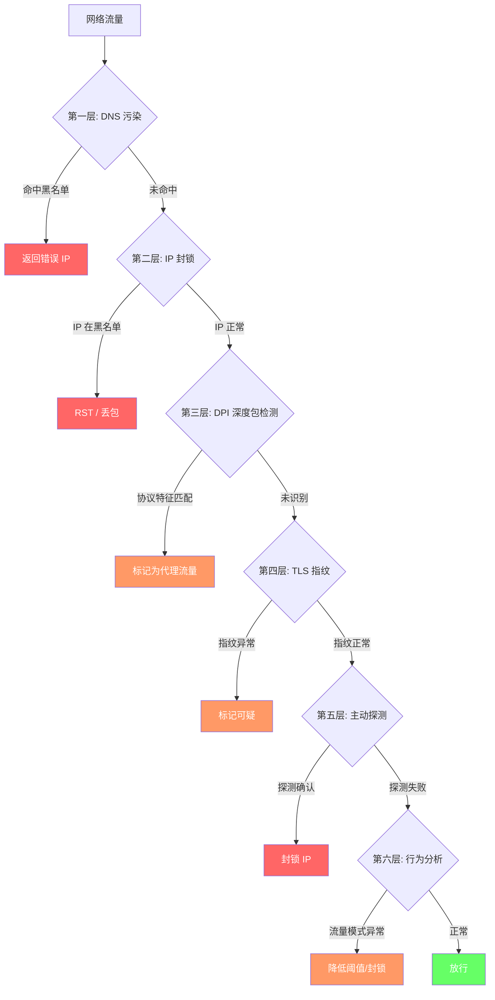

> **摘要**：GFW（Great Firewall）并非单一技术，而是一套由 DNS 污染、IP 封锁、深度包检测（DPI）、TLS 指纹识别、主动探测和流量行为分析共同构成的多层检测系统。本文逐层拆解这六种核心检测机制的工作原理，分析它们各自的能力边界与盲区，比较主流代理协议在每一层的抗检测表现，并给出对应的规避思路。理解这些机制，是选择和配置代理方案的前提。

---

## GFW 不是一堵"墙"

很多人把 GFW 想象成一个简单的黑名单过滤器——把被禁网站的域名或 IP 加入列表，然后拦截匹配的流量。实际上它是一个多层次、持续演进的流量分析系统，从网络层到应用层部署了多种检测手段，并且这些手段之间相互配合、交叉验证。

理解这一点很重要：**没有一种协议能"永远安全"，因为检测侧也在持续迭代。** 今天有效的规避方案，明天可能就被针对。反过来，今天被封锁的协议，通过改进也可能重新获得生存空间。封锁与反封锁本质上是一场持续的技术博弈。

下面按检测复杂度从低到高，逐层拆解 GFW 的核心检测机制。

---

## 检测机制逐层拆解

### 第一层：DNS 污染

**原理**：

DNS 污染是 GFW 最古老的封锁手段，技术门槛最低但覆盖面极广。其工作方式如下：

- GFW 在骨干网节点上监听所有经过的 UDP 53 端口 DNS 查询报文。
- 当检测到查询的域名命中黑名单（如 google.com、youtube.com 等），GFW 会抢在真正的 DNS 服务器响应之前，伪造一个包含错误 IP 地址的 DNS 应答包返回给用户。
- 由于 DNS 协议本身没有验证机制（传统 UDP DNS），客户端无法区分真假应答，通常会接受先到达的那个——也就是 GFW 伪造的错误结果。
- 用户的浏览器拿到错误的 IP 后，要么连接到一个不存在的地址，要么被导向一个无关的服务器，从而无法访问目标网站。

**绕过方式**：

- **DoH（DNS over HTTPS）/ DoT（DNS over TLS）**：将 DNS 查询加密传输，GFW 无法看到查询内容，也就无法进行针对性的污染。
- **Fake-IP 模式**：代理客户端（如 Clash）在本地为被代理的域名分配一个虚拟 IP，DNS 解析完全在远端代理服务器上完成，本地不产生真实的 DNS 查询。
- **远端 DNS 解析**：所有 DNS 请求通过代理隧道发送到海外 DNS 服务器解析，绕过国内骨干网的监听点。

**为什么它仍然有效**：

尽管绕过 DNS 污染的技术手段已经很成熟，但绝大多数普通用户不会主动配置 DNS 设置。他们使用的是运营商默认分配的 DNS 服务器，查询走的是未加密的 UDP 53 端口——这正是 GFW 的拦截范围。对于不使用任何代理工具的普通用户来说，DNS 污染依然是最有效的第一道封锁线。

---

### 第二层：IP 封锁

**原理**：

GFW 维护着一份持续更新的被封锁 IP 地址和 IP 段列表。当用户发起的 TCP 连接目标 IP 命中这份列表时，GFW 会采取两种干预措施之一：

- **发送 TCP RST 包**：伪造一个 TCP 重置报文注入连接，强制中断双方的通信。
- **静默丢包**：直接丢弃所有发往该 IP 的数据包，连接超时而非被主动中断。

**特点**：

这种封锁方式简单粗暴但非常有效，尤其适用于封锁已知的商业 VPN 服务器 IP 段。一旦某个 VPN 提供商的服务器 IP 被识别并加入黑名单，该 IP 上所有端口的所有连接都会被阻断，与协议和加密方式无关。这也是为什么很多免费或廉价的 VPN 服务频繁失效——它们的服务器 IP 已被批量封锁。

**应对思路**：

- **节点 IP 轮换**：频繁更换服务器 IP 地址，使得 GFW 的 IP 黑名单无法长期跟踪。
- **CDN 中转**：利用 Cloudflare 等 CDN 服务作为前置代理，流量先经过 CDN 的 Anycast 网络再转发到实际服务器。由于 CDN 承载大量正常网站流量，GFW 不太可能封锁整个 CDN 的 IP 段。
- **Anycast IP**：使用具有全球 Anycast 地址的服务，这些 IP 同时服务大量合法业务，封锁代价过高。

---

### 第三层：深度包检测（DPI）

**原理**：

深度包检测是 GFW 技术能力的核心跃升。与前两层只看 IP 地址和端口号不同，DPI 深入分析数据包的实际内容和格式，通过识别协议特征指纹来判断流量类型。

GFW 的 DPI 系统已知能够识别以下协议：
- **未加密的 Shadowsocks（旧版）**：早期版本的 Shadowsocks 在流量特征上存在明显的可识别模式。
- **裸 VMess 协议**：未经 TLS 封装的 VMess 流量具有可被 DPI 捕捉的协议指纹。
- **OpenVPN**：无论使用 TCP 还是 UDP 模式，OpenVPN 的握手特征都非常明显。
- **WireGuard**：虽然协议设计精简高效，但其握手报文格式固定，容易被识别。

**它能看到什么**：

- **TLS 握手的明文部分**：包括 Client Hello 和 Server Hello 阶段的数据。在 TLS 连接建立之前，这些握手信息以明文传输，其中包含了 SNI（Server Name Indication，服务器名称指示）、支持的加密套件列表、TLS 版本号等关键信息。
- **数据包大小分布和时序特征**：即使内容加密，数据包的长度分布、发送间隔等元数据仍然可以被 DPI 系统捕获并用于流量分类。
- **协议握手的固定模式**：每种协议都有其独特的握手流程和报文格式，这些固定模式就是 DPI 用来识别协议的指纹。

**它看不到什么**：

- **TLS 加密后的应用层数据**：一旦 TLS 握手完成、加密信道建立，后续传输的应用层数据对 DPI 来说是不透明的。
- **正确实现的加密协议内容**：如 SS-2022、VLESS+Reality 等现代协议，在加密实现上消除了已知的流量特征，DPI 无法通过内容分析识别它们。

---

### 第四层：TLS 指纹识别（JA3/JA4）

**这是当前最关键的检测维度之一。**

**原理**：

TLS 协议在握手阶段（Client Hello）会以明文发送大量元数据，包括：客户端支持的加密套件（Cipher Suites）列表、TLS 扩展（Extensions）列表、支持的椭圆曲线（Elliptic Curves）参数、签名算法列表等。

这些参数的具体组合因 TLS 实现库的不同而各异。JA3 和 JA4 算法正是利用这一点，将 Client Hello 中的这些参数提取并哈希成一个固定长度的指纹值。不同的 TLS 库——Go 标准库的 crypto/tls、Rust 的 rustls、浏览器原生的 BoringSSL/NSS、以及 uTLS 等模拟库——各自产生的指纹都不相同。

GFW 通过将观察到的 TLS 指纹与已知的浏览器指纹库进行比对，可以判断发起连接的客户端是否为真实的浏览器。如果指纹不匹配任何已知浏览器，该连接就会被标记为可疑。

**为什么这对代理很致命**：

- **Go 语言的指纹问题**：绝大多数主流代理工具（[Xray-core](https://github.com/XTLS/Xray-core)、sing-box 等）使用 Go 语言开发，而 Go 标准库 crypto/tls 产生的 TLS 指纹与 Chrome、Firefox 等主流浏览器的指纹存在明显差异。这使得代理流量即使伪装成 HTTPS，在指纹层面仍然一眼可辨。
- **uTLS 模拟的局限性**：虽然 [uTLS](https://github.com/refraction-networking/utls) 库试图模拟浏览器的 TLS 指纹，但模拟的完整度和对浏览器版本更新的跟进及时性始终是问题。浏览器每次更新都可能改变指纹参数，uTLS 的模拟总是存在滞后。
- **Reality 协议的解决方案**：Reality 从根本上解决了这个问题——它不模拟指纹，而是直接与一个真实的目标网站建立 TLS 连接，将该网站返回的真实 Server Hello 原样转发给 GFW。从 GFW 的视角看，这就是一个完全正常的、指向合法网站的 TLS 连接。

**当前状态**：

GFW 在 TLS 指纹识别上已具备实际执行能力。使用未经指纹伪装的 TLS 代理连接（如裸 Go TLS）在高审查时期被阻断的概率显著上升。指纹检测通常不会单独触发封锁，而是作为综合评分体系中的一个高权重维度——当 TLS 指纹异常与其他可疑特征叠加时，封锁概率大幅增加。

---

### 第五层：主动探测

**原理**：

GFW 不只是被动地坐在骨干网上监听流量——它还会主动出击。当被动检测系统标记某个服务器 IP 或端口为可疑后，GFW 会从位于中国境内的多个 IP 地址主动向该服务器发起连接，试图验证其是否运行着代理服务。

这种主动探测对早期的 Shadowsocks 和 V2Ray 部署造成了毁灭性打击，因为这些服务在收到无效请求时的响应行为与正常 Web 服务器存在明显差异。

**探测策略**：

- **重放攻击**：GFW 抓取用户与服务器之间的真实握手数据包，然后在稍后的时间从不同的 IP 重新发送这些包，观察服务器的响应。如果服务器接受了重放的握手并建立连接，就证明它运行着代理服务。
- **随机数据探测**：向可疑端口发送各种随机构造的数据，观察服务端返回的错误信息。不同的代理协议在处理非法输入时返回的错误类型和时序各不相同，这些差异本身就是识别特征。
- **协议探测**：以不同的已知协议格式尝试与服务端握手，逐一排查服务端可能运行的代理类型。

**防御方式**：

- **Reality 的设计哲学**：Reality 协议从设计之初就以抗主动探测为核心目标。当探测者连接 Reality 服务端时，如果无法提供正确的认证信息，服务端会将连接透明地转发给一个预设的真实网站（如 www.microsoft.com）。探测者看到的是一个完全正常的网站响应，无法判断该服务器是否运行代理。
- **SS-2022 的重放保护**：Shadowsocks 2022 版本引入了基于时间戳的重放过滤机制，每个握手包都包含时间窗口校验，重放过去的握手包会被自动拒绝。
- **正确的错误处理**：优秀的代理服务端实现在收到任何无效请求时，其行为表现（响应内容、响应时间、连接断开方式）与正常的 Web 服务器完全一致，不泄露任何代理服务的存在。

---

### 第六层：流量行为分析（统计分析）

**原理**：

这是 GFW 检测体系中最难对抗的一层。即使代理协议在协议层面做到了完美伪装——DPI 看不出破绽、TLS 指纹完美匹配、主动探测也无法验证——长期的流量行为模式本身仍然可能暴露代理使用。

GFW 的行为分析系统会关注以下维度：
- **连接频率**：一个家庭宽带 IP 每天向同一个海外 IP 发起数百次加密连接，这种模式极其异常。
- **数据包大小分布**：代理流量的包大小分布与正常网页浏览存在统计差异。
- **连接持续时间**：代理连接（尤其是全局代理模式下）的持续时间特征与普通 HTTPS 请求不同。
- **时段规律**：流量集中在特定时段（如工作时间持续翻墙）也会被标记为异常模式。

简而言之：一个 IP 长期与海外单一 IP 保持高频加密连接，无论协议如何伪装，这种行为模式本身就是一个强烈的异常信号。

**为什么这很难对抗**：

- 这是统计层面的检测，完全不依赖协议指纹。即使你的协议在逐个数据包层面无懈可击，宏观的流量模式仍然可以出卖你。
- 你可以完美伪装协议，但你无法伪装"一个用户每天 8 小时不间断地通过加密隧道传输大量数据"这种使用模式。
- 目前没有完美的解决方案，只能通过降低流量异常度来降低被标记的风险。

**缓解策略**：

- **多节点轮换**：避免长期连接单一海外 IP。使用多个节点并定期切换，将流量分散到不同的目标 IP 上。
- **中转节点**：使用位于国内的中转服务器分散源 IP 特征，让 GFW 看到的是中转服务器到海外的连接，而非用户直连海外。
- **混入正常流量**：不要使用全局代理模式，采用分流规则让国内流量直连、仅代理需要翻墙的流量，使整体流量模式更接近正常用户。

---

## 各层检测 vs 主流协议

| 检测层 | SS-2022 | VMess | VLESS+Reality | Trojan | Hysteria2 |
|-------|---------|-------|--------------|--------|-----------|
| DNS 污染 | 可绕过 | 可绕过 | 可绕过 | 可绕过 | 可绕过 |
| IP 封锁 | 需轮换 | 需轮换 | 需轮换 | 需轮换 | 需轮换 |
| DPI | ✅ 抗性强 | ❌ 可识别 | ✅ 抗性强 | ✅ 抗性强 | ⚠️ 取决于环境 |
| TLS 指纹 | N/A | ⚠️ 可识别 | ✅ 完美伪装 | ⚠️ 取决于实现 | N/A (QUIC) |
| 主动探测 | ✅ 2022 版已修复 | ❌ 易被探测 | ✅ 返回真实站点 | ⚠️ 取决于配置 | ⚠️ 中等 |
| 行为分析 | ⚠️ | ⚠️ | ⚠️ | ⚠️ | ⚠️ |

**表格解读**：

- DNS 污染层所有代理协议都可以绕过，因为代理客户端本身就承担了 DNS 解析的转发。
- IP 封锁对所有协议一视同仁，唯一的应对是节点管理策略（轮换、CDN、中转）。
- DPI 层是协议设计的分水岭：VMess 裸协议已被 GFW 标记，而 SS-2022 和 VLESS+Reality 在当前阶段具备较强的抗 DPI 能力。
- TLS 指纹层是 VLESS+Reality 的最大优势所在：它是唯一在指纹层面做到"完美伪装"的方案。
- 行为分析层对所有协议都是威胁，没有任何协议能在统计层面完全隐身。

---

## 核心结论

经过以上六层分析，可以得出三个核心判断：

**1. 没有完美的协议，检测与反检测是持续的博弈。**

任何声称"绝对安全"的协议都在误导用户。GFW 的检测系统在持续升级——从最初的 DNS 污染到 DPI，再到 TLS 指纹和行为分析——每一次升级都淘汰了一批曾经有效的方案。今天的最优选择（如 VLESS+Reality），明天也可能面临新的检测维度。保持对技术动态的关注比盲目信任任何单一协议更重要。

**2. 运营敏捷性比协议选择更重要。**

在实际对抗中，快速切换节点、自动故障转移、多节点负载均衡等运营层面的能力，往往比底层协议的选择更能决定可用性。一个使用 VLESS+Reality 但只有单一节点的用户，在节点 IP 被封后会完全失去连接；而一个拥有自动故障转移和多节点池的用户，即使使用稍弱的协议，也能保持更高的可用性。

**3. 多层防御优于单点强化。**

只关注协议层安全而忽视 DNS 泄露、IP 暴露、流量模式等其他层面，等于在一扇门上装了五把锁却敞着窗户。有效的规避策略需要在每一层都有应对：加密 DNS、节点 IP 管理、协议指纹伪装、抗主动探测配置、流量行为分散——缺一不可。

---

## 常见问题

### Q: 用了 VLESS+Reality 就绝对安全了吗？

不是。VLESS+Reality 在协议层面确实做到了当前最优——完美的 TLS 指纹、强大的抗主动探测能力、DPI 不可识别。但它无法解决第六层的行为分析问题。如果你的使用模式表现出明显的异常特征（长时间高频连接单一海外 IP），即使 Reality 协议本身无懈可击，你的连接仍然可能被标记和干扰。此外，IP 封锁也与协议无关——服务器 IP 一旦进入黑名单，Reality 也救不了。协议是防线之一，不是全部。

### Q: GFW 会封锁所有 VPN 吗？

不会。GFW 的封锁策略具有选择性，这与政策和实际需求有关。部分商业 VPN 在特定时期仍然可用，这是因为大量外企、跨境电商、科研机构有合法的跨境网络需求。完全切断所有加密跨境连接会对经济活动造成严重影响。因此 GFW 在执行上是有弹性的：对明显的个人翻墙工具打击力度大，对面向企业的合规 VPN 方案相对宽容，但这种容忍度会随政策周期波动。

### Q: 敏感时期为什么封锁会加强？

敏感时期（如重大会议、特定纪念日等）GFW 会临时调整检测策略：降低触发封锁的阈值、启用更激进的检测规则、扩大主动探测的范围和频率。平时可能只是标记但不阻断的可疑连接，在敏感时期会被直接封锁。这是一种临时性的策略调整——通过短期内提高封锁力度来实现特定时段的信息管控，事后通常会回到常规检测水平。了解这种周期性规律有助于你在敏感时期提前做好备用节点和备用协议的准备。
