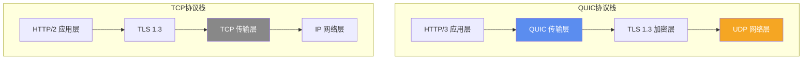
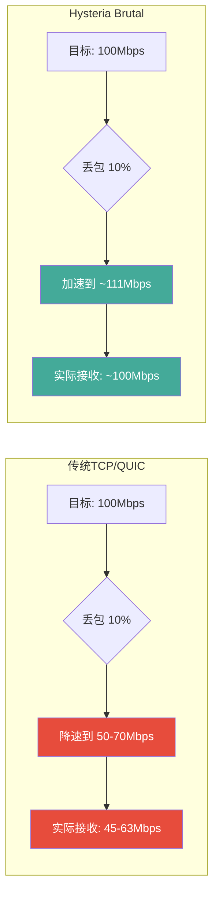
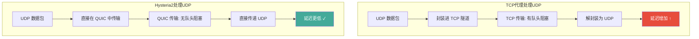

> **摘要**：Hysteria 2 是一个基于修改版 QUIC 协议的代理工具，它的核心卖点只有一个——**快**。通过自定义的 Brutal 拥塞控制算法，Hysteria 2 可以在丢包率高达 10-20% 的恶劣网络环境下仍然维持接近带宽上限的传输速度。本文深入解析 Hysteria 2 的设计原理、与其他协议的核心差异、部署配置以及适用场景分析。

## Hysteria 的设计动机

传统代理协议（如 VLESS、Trojan）都基于 TCP 传输。TCP 的可靠传输机制有一个特点：当网络出现丢包时，TCP 会**主动降速**——这是 TCP 拥塞控制算法（如 CUBIC、BBR）的核心行为。TCP 假设丢包意味着网络拥塞，因此通过降低发送速率来"让出"带宽。

这个机制在正常互联网环境下工作得很好。但在代理场景中，问题来了：

1. **国际出口的丢包不一定是拥塞**：跨境链路的丢包可能是 QoS 策略、线路质量波动等原因造成的，降速并不能改善情况
2. **GFW 的主动干扰**：GFW 可能通过注入 RST 包或选择性丢包来干扰代理连接，TCP 会错误地认为是拥塞并降速
3. **高峰期的带宽竞争**：当国际出口带宽紧张时，使用"温和"拥塞控制的 TCP 连接会被"激进"的连接挤压

[Hysteria](https://hysteria.network/) 项目的解决方案很直接：**不用 TCP，改用 UDP（QUIC）；不用标准拥塞控制，改用自定义的激进算法**。

## QUIC 协议基础

QUIC（Quick UDP Internet Connections）最初由 Google 开发，后来被 IETF 标准化为 HTTP/3 的底层传输协议。Hysteria 2 基于 QUIC 构建，但对其进行了修改。

### 标准 QUIC 的关键特性



QUIC 相比 TCP 的优势：

| 特性 | TCP | QUIC |
|------|-----|------|
| 传输层 | 内核实现 | 用户态实现 |
| 握手延迟 | TCP 握手 + TLS 握手 (2-3 RTT) | 0-1 RTT |
| 队头阻塞 | 有（单连接内所有流互相阻塞） | 无（多流独立传输） |
| 连接迁移 | 不支持（IP 变化需重连） | 支持（基于 Connection ID） |
| 加密 | 可选 | 强制 TLS 1.3 |
| NAT 穿透 | 困难 | 相对容易（UDP） |

### Hysteria 对 QUIC 的修改

Hysteria 2 并不使用标准 QUIC。它保留了 QUIC 的加密和多路复用能力，但**替换了拥塞控制算法**——这是 Hysteria 的核心创新。

标准 QUIC 实现（如 Google 的 quiche 或 Cloudflare 的 quiche）使用类似 TCP 的拥塞控制（Cubic、BBR 等），遇到丢包同样会降速。Hysteria 2 将其替换为自定义的 **Brutal** 算法。

## Brutal 拥塞控制：核心原理

Brutal 算法的设计哲学可以用一句话概括：**你告诉我你有多少带宽，我就用多少带宽，不管丢包**。

### 工作方式

传统拥塞控制算法（如 BBR）会通过不断试探来动态调整发送速率：

```
BBR: 慢启动 → 探测带宽 → 如果丢包 → 降低发送速率 → 重新探测
```

Brutal 的方式完全不同：

```
Brutal: 用户指定目标带宽 → 按目标带宽发送 → 如果丢包 → 增加发送速率（补偿丢包）
```

是的，你没看错——**当网络丢包时，Brutal 不是降速，而是加速**。逻辑是这样的：如果你的目标带宽是 100 Mbps，而当前丢包率是 10%，那么 Brutal 会以约 111 Mbps 的速率发送数据，确保经过丢包后实际到达对端的有效数据量仍然是 100 Mbps。



### 为什么这样做有效

在跨境代理场景中，丢包的原因通常不是传统意义上的"网络拥塞"。国际出口的带宽是运营商分配的固定容量，丢包可能是：

1. **QoS 策略**：运营商对特定类型的流量进行限速
2. **线路质量波动**：海底光缆的信号衰减、设备故障等
3. **GFW 干扰**：选择性丢包或注入干扰

在这些场景下，TCP 的"降速让步"策略完全是在浪费可用带宽。Brutal 的激进策略反而能充分利用剩余带宽。

### 需要注意的争议

Brutal 算法的激进性质也意味着它对网络不够"友好"——在带宽有限的共享网络中，Hysteria 可能会挤占其他用户的带宽。这是一个设计权衡：

- **对使用者**：高丢包环境下速度更快
- **对网络**：可能加剧拥塞（如果带宽确实不足）
- **对其他用户**：共享带宽场景下可能"欺负"使用标准拥塞控制的连接

因此，Hysteria 官方建议：**将带宽设置为你的实际线路带宽，不要设得过高**。设置过高会导致大量无效的重传包，反而浪费带宽和增加延迟。

## Hysteria 2 vs Hysteria 1

Hysteria 经历了从 1.x 到 2.x 的重大升级。以下是关键差异：

| 特性 | Hysteria 1 | Hysteria 2 |
|------|-----------|-----------|
| 协议伪装 | 自定义 QUIC 头部 | 标准 HTTP/3 握手 |
| 认证方式 | 自定义 | 标准 HTTP/3 + 密码 |
| TLS 证书 | 自签名（常见） | 支持 ACME 自动获取 |
| 抗检测 | 中等（自定义头部可识别） | 较强（标准 HTTP/3 流量） |
| 性能 | 高 | 更高（优化了协议开销） |
| 客户端支持 | 较广 | 逐步扩展 |

Hysteria 2 的最大改进是在协议层面——它的握手过程与标准 HTTP/3 完全一致，从外部看就是一个普通的 HTTP/3 连接。这使得 GFW 很难通过协议特征来识别 Hysteria 2 流量。

## 完整部署配置

### 服务端配置

Hysteria 2 使用 YAML 格式的配置文件：

```yaml
# hysteria2 server config
listen: :443

# TLS 证书（推荐使用 ACME 自动获取）
acme:
  domains:
    - your-domain.com
  email: your-email@example.com

# 或者手动指定证书
# tls:
#   cert: /path/to/cert.pem
#   key: /path/to/key.pem

# 认证
auth:
  type: password
  password: your-strong-password

# 伪装站点（当非 Hysteria 客户端访问时显示的网站）
masquerade:
  type: proxy
  proxy:
    url: https://www.bing.com
    rewriteHost: true
```

**配置说明**：

- `listen: :443` — 监听 443 端口，与标准 HTTPS 一致
- `acme` — 自动从 Let's Encrypt 获取 TLS 证书（需要域名指向服务器 IP）
- `masquerade` — 伪装网站。当有人直接用浏览器访问你的服务器时，会看到反代的 Bing 搜索页面，而不是报错或空白页

### 客户端配置

**Hysteria 2 原生客户端**：

```yaml
server: your-domain.com:443
auth: your-strong-password

bandwidth:
  up: 50 mbps
  down: 100 mbps

socks5:
  listen: 127.0.0.1:1080

http:
  listen: 127.0.0.1:8080
```

**关键参数**：`bandwidth` 的 `up` 和 `down` 设置。这直接决定了 Brutal 算法的行为——设置为你的实际线路带宽。过高会浪费流量（大量重传），过低则无法充分利用带宽。

**Clash.Meta (mihomo) 配置**：

```yaml
proxies:
  - name: "hysteria2-node"
    type: hysteria2
    server: your-domain.com
    port: 443
    password: your-strong-password
    up: "50 Mbps"
    down: "100 Mbps"
    # sni: your-domain.com  # 通常不需要，自动从 server 推断
```

**sing-box 配置**：

```json
{
  "type": "hysteria2",
  "tag": "hy2-node",
  "server": "your-domain.com",
  "server_port": 443,
  "password": "your-strong-password",
  "up_mbps": 50,
  "down_mbps": 100,
  "tls": {
    "enabled": true,
    "server_name": "your-domain.com"
  }
}
```

## 与其他协议的对比

| 维度 | VLESS+Reality | Trojan | Hysteria 2 | TUIC |
|------|--------------|--------|-----------|------|
| 底层协议 | TCP | TCP | UDP (QUIC) | UDP (QUIC) |
| 拥塞控制 | 系统默认(BBR等) | 系统默认 | Brutal(自定义) | 标准 QUIC |
| 高丢包环境性能 | 较差 | 较差 | 极好 | 好 |
| 抗 GFW 检测 | 极强(Reality伪装) | 较强 | 较强(HTTP/3伪装) | 中等 |
| 流量伪装 | 伪装为 HTTPS | 伪装为 HTTPS | 伪装为 HTTP/3 | 伪装为 QUIC |
| 需要域名 | 不需要 | 需要 | 需要（推荐） | 需要 |
| 多路复用 | 可选(XMUX) | 可选 | 原生支持 | 原生支持 |
| UDP 转发 | 通过 TCP 隧道 | 通过 TCP 隧道 | 原生 UDP | 原生 UDP |
| 适合场景 | 抗检测优先 | 兼容性优先 | 速度优先 | 平衡 |

### Hysteria 2 vs TUIC

TUIC 也是基于 QUIC 的代理协议，但它使用标准的 QUIC 拥塞控制。在正常网络环境下，两者性能差异不大；但在高丢包环境中，Hysteria 2 的 Brutal 算法会表现出明显优势。

### Hysteria 2 vs VLESS+Reality

这两个协议的设计目标不同：

- **VLESS+Reality** 的核心目标是**不被发现**（极致的流量伪装）
- **Hysteria 2** 的核心目标是**传输更快**（极致的速度）

如果你的 VPS 线路质量好、丢包率低，VLESS+Reality 的速度和 Hysteria 2 差距不大，但抗检测能力更强。如果你的线路丢包率高（5% 以上），Hysteria 2 的速度优势会非常明显。

## UDP 转发的天然优势

Hysteria 2 基于 UDP 构建，对 UDP 流量有天然的传输优势。传统 TCP 代理处理 UDP 流量（如游戏、语音通话、视频会议）时，需要将 UDP 数据包封装在 TCP 隧道中传输——这引入了 TCP 的队头阻塞问题和额外延迟。

Hysteria 2 直接在 QUIC（UDP）层面传输 UDP 数据包，避免了这些问题：



这使得 Hysteria 2 特别适合以下场景：
- 在线游戏（低延迟 UDP 通信）
- VoIP 语音通话
- 视频会议
- 实时直播推流

## 客户端支持情况

| 客户端 | 平台 | 支持状态 |
|--------|------|---------|
| [Hysteria 2 官方客户端](https://hysteria.network/) | 全平台 | 完整支持 |
| [Clash.Meta / mihomo](https://github.com/MetaCubeX/mihomo) | 全平台 | 完整支持 |
| [sing-box](https://github.com/SagerNet/sing-box) | 全平台 | 完整支持 |
| [Shadowrocket](https://apps.apple.com/app/shadowrocket/id932747118) | iOS | 完整支持 |
| [NekoBox](https://github.com/MatsuriDayo/NekoBoxForAndroid) | Android | 完整支持 |
| [v2rayN](https://github.com/2dust/v2rayN) | Windows | 通过 sing-box 核心支持 |
| Surge | iOS/macOS | 不支持 |

## 部署注意事项

### 带宽设置是关键

Brutal 算法的效果完全取决于带宽参数的准确性：

- **设置过高**：发送大量超出实际带宽的数据包，绝大部分会被丢弃，反而导致速度下降和流量浪费
- **设置过低**：无法充分利用可用带宽
- **建议**：设置为实际带宽的 80-90%。例如，100M 带宽的线路，设置 80-90 Mbps

### 需要真实域名和证书

Hysteria 2 需要有效的 TLS 证书。最简单的方式是使用 ACME 自动获取 Let's Encrypt 证书，这需要一个解析到服务器 IP 的域名。

### UDP 端口放行

Hysteria 2 使用 UDP 协议，需要确保服务器的防火墙和 VPS 提供商都放行了 UDP 443 端口。某些 VPS 提供商默认阻止 UDP 流量。

### 运营商可能限制 UDP

部分运营商会对 UDP 流量进行限速或 QoS。如果发现 Hysteria 2 速度异常，可能是运营商在限制 UDP 流量。这种情况下可以考虑改用基于 TCP 的方案（如 VLESS+Reality）。

## 常见问题

### Q: Hysteria 2 容易被 GFW 检测吗？

Hysteria 2 的握手过程与标准 HTTP/3 一致，从协议层面不容易被识别。但 GFW 可能通过其他方式检测：

1. **端口检测**：如果大量 UDP 流量集中在 443 端口，可能引起注意
2. **流量特征**：Brutal 算法的激进发送行为在流量统计上可能与正常 HTTP/3 不同
3. **活跃探测**：直接访问服务器的 443 端口，如果伪装站点配置不当可能暴露

### Q: Hysteria 2 和 Hysteria 1 能共存吗？

不建议。Hysteria 2 是完全独立的协议，与 1.x 不兼容。建议直接使用 Hysteria 2。

### Q: 为什么我的 Hysteria 2 速度反而不如 VLESS？

最可能的原因是带宽参数设置不合理（过高或过低），或者运营商对 UDP 流量有限制。检查带宽设置是否匹配实际线路，以及运营商是否限制了 UDP。

### Q: 能否同时部署 Hysteria 2 和 VLESS+Reality？

可以，这是一种很好的策略——用 VLESS+Reality 作为日常方案（抗检测强），用 Hysteria 2 作为速度方案（大文件下载、视频等）。两者使用不同的端口即可。

## 参考链接

- [Hysteria 2 官方网站](https://hysteria.network/) — 官方文档和下载
- [Hysteria 2 GitHub](https://github.com/apernet/hysteria) — 源代码
- [QUIC 协议 RFC 9000](https://www.rfc-editor.org/rfc/rfc9000) — QUIC 协议标准
- [Brutal 拥塞控制说明](https://hysteria.network/docs/advanced/Full-Server-Config/) — Brutal 算法的官方说明

---

*Hysteria 2 代表了代理协议设计中"速度优先"的极端思路。它不追求最完美的伪装，而是用暴力的带宽利用率来换取在恶劣网络环境下的最佳速度体验。*
