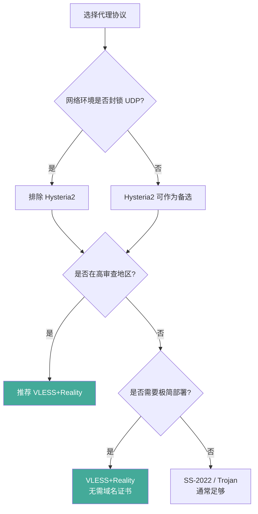

> **摘要**: 本文对比当前主流的代理协议——Shadowsocks、VMess、VLESS+Reality、Trojan、Hysteria2、NaiveProxy、VLESS+XHTTP——从加密方式、抗检测能力、性能表现、部署难度四个维度进行系统评估，帮助用户根据自身需求选择合适的协议。无论你是刚入门的新手还是有经验的运维人员，本文都将提供有价值的参考。

## 为什么需要这篇对比

市面上的协议对比文章大多停留在"推荐用 XX"的结论层面，缺乏对底层原理的解释。不同协议在不同网络环境下表现差异很大，理解它们的设计思路比记住结论更重要。

GFW 的检测能力在持续进化，2024 年以来对裸 VMess 的精准封锁、对 QUIC 流量的深度分析都表明：单纯依赖某个"最强协议"的思路已经过时。真正有效的策略是理解每个协议的优势边界，根据实际网络环境灵活组合。

本文不会告诉你"用这个就行了"，而是帮你建立判断框架——当环境变化时，你能自己做出正确选择。

## 协议概览

| 协议 | 传输层伪装 | 抗主动探测 | 抗流量分析 | 性能开销 | 部署复杂度 |
|------|-----------|-----------|-----------|---------|-----------|
| Shadowsocks (2022) | 无 | 较强 | 中等 | 低 | 简单 |
| VMess | 无 | 弱 | 中等 | 中等 | 简单 |
| VLESS + Reality | TLS 伪装 | 强 | 较强 | 低 | 中等 |
| Trojan | 真实 TLS | 中等 | 中等 | 中等 | 中等 |
| Hysteria2 | QUIC 伪装 | 中等 | 中等 | 低 | 简单 |
| NaiveProxy | 浏览器栈 | 强 | 较强 | 中等 | 复杂 |
| VLESS+XHTTP+Reality | HTTP 伪装 | 强 | 强 | 中等 | 复杂 |

> 以上评估基于 2026 年中的 GFW 状态，检测策略持续演进，评估结论可能随时间变化。


## 逐一解析

### Shadowsocks (2022 Edition / AEAD-2022)

**设计思路**：

Shadowsocks 的核心设计理念是"轻量级加密代理"——不做伪装，只做加密转发。它不试图让流量看起来像正常的 HTTPS 或其他协议，而是通过加密让审查者无法解析流量内容。

早期版本（stream cipher、AEAD）存在严重的安全缺陷：重放攻击可以让审查者录制一段加密流量后重新发送给服务器，通过观察服务器的响应行为判断是否为 Shadowsocks 服务；主动探测则允许审查者直接向疑似 SS 的端口发送特定构造的数据包，根据服务器的错误响应来确认协议类型。

AEAD-2022（即 Shadowsocks 2022 Edition）对这些问题做了根本性修复：引入了基于时间戳的重放过滤机制，每个数据包都绑定了时间窗口，过期数据包直接丢弃；对于无法解密的请求，服务器不再返回任何有辨识度的错误响应，而是直接静默关闭连接，使主动探测失去依据。

**适用场景**：

对延迟敏感的使用场景（如游戏加速、实时通信），以及网络环境相对宽松、审查力度不大的地区。如果你的线路质量好、ISP 对加密流量不做针对性干扰，SS 2022 仍然是性价比最高的选择。

---

### VMess

**设计思路**：

VMess 是 V2Ray 项目的原生协议，设计目标是提供自带加密和身份认证的代理通信。它使用 UUID 作为用户标识，通过自定义的加密方案实现数据传输。

**为什么不再推荐**：

VMess 在设计之初（2017 年前后）是一个合理的选择，但以 2026 年的标准来看，它在安全性和抗检测能力上都已经落后。GFW 对 VMess 的识别准确率很高，即使在低审查时期也可能被标记。更重要的是，VLESS+Reality 在各方面都是 VMess 的上位替代——更安全、更难检测、性能更好。如果你还在使用 VMess，强烈建议尽快迁移。

---

### VLESS + Reality

**设计思路**：

VLESS+Reality 是当前最受推荐的协议组合。VLESS 本身是一个极简的代理协议——去掉了 VMess 中多余的加密层（因为 TLS 已经提供了加密），只保留最基本的认证和数据传输功能。而 Reality 则是 TLS 伪装层面的一次根本性创新。

传统的 TLS 伪装（如 Trojan）需要你拥有一个真实的域名和对应的 TLS 证书。Reality 的核心思路是：**借用目标网站的 TLS 证书来完成伪装，而不需要你自己申请任何证书或拥有任何域名**。

**适用场景**：

当前大多数用户的最佳选择。无论是个人使用还是为他人提供服务，VLESS+Reality 都提供了最好的安全性与易用性平衡。除非你有特殊的带宽需求（考虑 Hysteria2）或极端的隐蔽性需求（考虑 VLESS+XHTTP+Reality），否则 VLESS+Reality 就是你的默认选项。

---

### Trojan

**设计思路**：

Trojan 的设计目标是让代理流量完全模仿正常的 HTTPS 流量。它直接工作在 TLS 层之上，使用真实的 TLS 证书（通过 Let's Encrypt 等 CA 签发），代理数据通过标准的 TLS 加密通道传输。

**劣势**：需要拥有域名并申请、维护 TLS 证书（Let's Encrypt 证书每 90 天需要续期）。TLS 指纹仍然可被分析。域名本身可能被 DNS 污染或 SNI 封锁，一旦域名暴露，整个节点失效。

---

### Hysteria2

**设计思路**：

[Hysteria2](https://hysteria.network/) 是一个基于 QUIC（HTTP/3 的底层传输协议）构建的高性能代理协议。与前面所有基于 TCP 的协议不同，Hysteria2 走的是 UDP 路线。它利用 QUIC 的多路复用和 0-RTT 握手特性来实现低延迟连接，同时内置了一套自定义的拥塞控制算法（Brutal），可以在丢包率较高的线路上维持较高的传输速率。

**适用场景**：

网络环境允许 UDP 且对带宽有高要求的场景——流媒体、大文件下载、视频通话等。如果你的 ISP 对 UDP 友好且线路质量一般（丢包较高），Hysteria2 的 Brutal 拥塞控制能带来明显优于 TCP 协议的体验。但一定要准备 TCP 协议作为后备方案。

---

### NaiveProxy

**设计思路**：

[NaiveProxy](https://github.com/klzgrad/naiveproxy) 采用了一个极为大胆的方案：直接嵌入 Chromium 的网络栈来处理代理流量。这意味着从 TLS 握手到 HTTP/2 连接管理，NaiveProxy 产生的每一个网络数据包都与真正的 Chrome 浏览器发出的完全一致——因为它用的就是 Chrome 的代码。

**劣势**：编译和维护成本极高。客户端选择极其有限。对于大部分用户而言，NaiveProxy 的抗检测优势相对于 VLESS+Reality 并不明显，但维护成本却高出很多。

---

### VLESS + XHTTP + Reality + XMUX

**设计思路**：

这是目前代理协议技术栈的"天花板"组合。它在 VLESS+Reality 的基础上更进一步：通过 XHTTP 传输层将代理数据伪装成普通的 HTTP 请求（而不仅仅是 TLS 加密隧道），并通过 XMUX 实现连接的多路复用。

**劣势**：部署复杂度是所有方案中最高的。客户端支持有限。对运维人员的技术水平要求较高。

---


## 如何选择

```
你的网络环境是否封锁 UDP？
├── 是 → 排除 Hysteria2
├── 否 → Hysteria2 可作为备选
│
你是否在高审查地区（中国大陆/伊朗/俄罗斯）？
├── 是 → 推荐 VLESS+Reality 或 VLESS+XHTTP+Reality
├── 否 → Shadowsocks 2022 / Trojan 通常足够
│
你是否需要极简部署？
├── 是 → VLESS+Reality（无需域名证书）
├── 否 → 根据抗检测需求选择
```



**补充建议**：

- **入门用户**：直接选 VLESS+Reality。教程多，部署不需要域名和证书，抗检测能力足够应对绝大多数场景。
- **追求带宽**：在主力节点使用 VLESS+Reality 的同时，准备 Hysteria2 作为 UDP 友好环境下的加速选项。
- **极端隐蔽需求**：VLESS+XHTTP+Reality+XMUX，但请确保你有足够的技术能力来维护。
- **始终准备备用方案**：不要只依赖一种协议。敏感时期多协议切换是最基本的运维策略。

## 常见问题

### Q: VMess 还能用吗？

可以用，但不推荐。VLESS+Reality 在几乎所有维度上都是 VMess 的上位替代，迁移成本也不高——如果你在用 [Xray-core](https://github.com/XTLS/Xray-core)，只需要修改配置文件即可。

### Q: Reality 的 dest 目标站如果被封了怎么办？

提前准备多个 dest 配置，至少 3-5 个备选目标站，确保可以快速切换。选择 dest 时验证目标站是否支持 TLS 1.3 和 H2。避免使用冷门站点。

### Q: 协议选择和节点质量哪个更重要？

节点质量和运营敏捷性比协议选择更重要。正确的优先级应该是：**运营敏捷性 > 线路质量 > 协议选择**。先确保你有快速响应封锁的能力，再考虑协议层面的优化。

### Q: Hysteria2 和 VLESS+Reality 哪个快？

取决于具体场景。UDP 友好 + 高丢包线路下 Hysteria2 明显更快；UDP 受限或正常线路下 VLESS+Reality 更稳定。两者并不互斥，可以在同一台服务器上同时部署。
