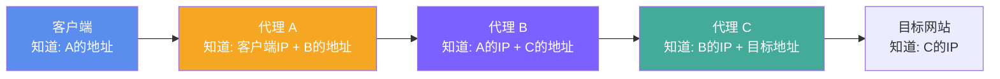
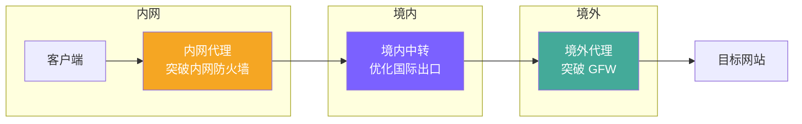
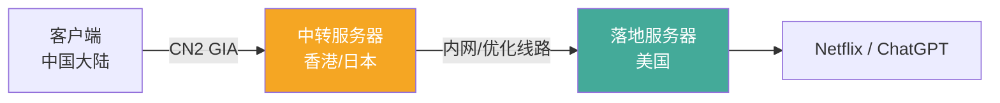
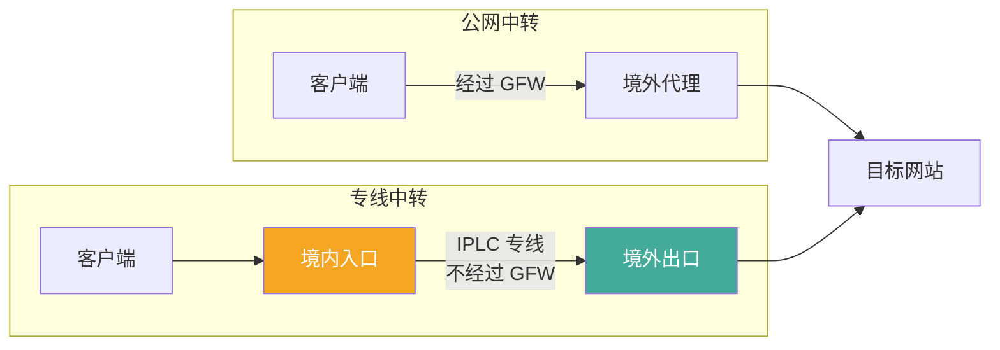

> **摘要**：代理链（Proxy Chain）是指将多个代理服务器串联起来，流量依次经过每一层代理后才到达最终目标。这种技术在提升匿名性、绕过多层封锁、优化网络路由等场景中有着重要应用。本文详细解析代理链的工作原理、常见架构、代理软件中的配置方法以及性能与安全的权衡。

## 什么是代理链

在最基本的代理架构中，流量路径是这样的：

```
客户端 → 代理服务器 → 目标网站
```

代理链则是在中间加入更多的代理节点：

```
客户端 → 代理 A → 代理 B → (代理 C → ...) → 目标网站
```

每一个代理节点只知道它的上游和下游是谁，不知道完整的链路。这种架构的核心价值在于：**没有任何单一节点掌握完整的通信信息**。



在这个例子中：
- **代理 A** 知道客户端的真实 IP，但不知道最终访问的是什么网站
- **代理 C** 知道访问的目标网站，但不知道客户端的真实 IP
- **代理 B** 既不知道客户端 IP，也不知道目标网站
- **目标网站** 只看到代理 C 的 IP

## 为什么需要代理链

### 场景一：增强匿名性

单层代理的问题是代理服务器掌握了全部信息——它既知道你是谁（客户端 IP），也知道你在访问什么（目标地址）。如果代理服务器被攻破、被传唤或者运营者本身不可信，你的隐私就完全暴露了。

代理链将这些信息分散到多个节点上。即使其中一个节点被攻破，攻击者也无法获取完整的通信信息。这就是 Tor（洋葱路由）的基本原理——通过三层代理（入口节点、中间节点、出口节点）实现匿名通信。

### 场景二：绕过多层封锁

某些网络环境存在多层封锁。例如：

- **第一层**：公司/学校内网防火墙，封锁了大部分代理协议的端口
- **第二层**：GFW，封锁了国际出口的代理流量

单一代理可能只能突破其中一层。通过代理链，可以分层突破：



### 场景三：路由优化（中转/落地分离）

这是代理服务中最常见的链式架构——将"中转"和"落地"分离到不同的服务器上：

- **中转服务器**：部署在有优质线路的位置（如 CN2 GIA 线路的 VPS），负责优化客户端到境外的传输路径
- **落地服务器**：部署在目标服务所在的地区（如日本、美国），负责最终访问目标网站



这种架构的好处是：中转服务器可以选择线路最好（但可能没有解锁能力）的位置，落地服务器可以选择有解锁能力（但线路可能一般）的位置。两者的优势互补。

### 场景四：IP 漂白

当代理出口 IP 被目标服务封锁时，可以在后面再加一层代理来换 IP：

```
客户端 → 主代理（IP被封） → WARP/另一个代理 → 目标网站（看到新IP）
```

这实际上是上一篇文章介绍的 WARP 用法的一般化——WARP 就是一种特殊的"第二层代理"。

## 代理链的类型

### 静态链（Static Chain）

链路中的每个节点都是预先配置好的，每次连接都走相同的路径。这是最简单也最常见的方式。

```
客户端 → 固定代理A → 固定代理B → 目标
```

优点：配置简单、延迟稳定
缺点：路径固定，如果某个节点出问题整个链路就断了

### 动态链（Dynamic Chain）

链路中的某些节点可以动态选择。如果某个节点不可用，自动跳到下一个可用节点。

```
客户端 → 代理A → 代理B(不可用,跳过) → 代理C → 目标
```

优点：容错性好
缺点：配置复杂，链路长度不固定

### 随机链（Random Chain）

每次连接随机选择不同的中间节点，增加追踪难度。

```
连接1: 客户端 → A → D → 目标
连接2: 客户端 → B → C → 目标
连接3: 客户端 → A → C → 目标
```

优点：最难追踪
缺点：延迟不稳定，某些组合可能很慢

## 在代理软件中配置代理链

### Clash/mihomo 的 proxy-groups 链式配置

Clash 通过 `proxy-groups` 的 `relay` 类型实现代理链：

```yaml
proxies:
  - name: "中转-香港"
    type: trojan
    server: hk-relay.example.com
    port: 443
    password: password1
    sni: hk-relay.example.com

  - name: "落地-美国"
    type: vless
    server: us-exit.example.com
    port: 443
    uuid: your-uuid
    network: tcp
    tls: true
    reality-opts:
      public-key: your-public-key
      short-id: abcd1234
    client-fingerprint: chrome

proxy-groups:
  - name: "链式代理"
    type: relay
    proxies:
      - "中转-香港"
      - "落地-美国"
```

**relay 类型**的工作方式：流量按照 proxies 列表的顺序依次经过每个代理节点。上面的配置等效于：

```
客户端 → 中转-香港 → 落地-美国 → 目标网站
```

**注意事项**：
- relay 链中的每个节点都需要能被上一个节点访问到
- 链中第一个节点（中转-香港）需要能从客户端直接访问
- 链中最后一个节点（落地-美国）需要能访问目标网站
- 中间节点（落地-美国）需要能被中转-香港访问
- 链越长延迟越高，一般不建议超过 3 层

### sing-box 的链式出站

sing-box 通过出站（outbound）的嵌套实现代理链：

```json
{
  "outbounds": [
    {
      "type": "trojan",
      "tag": "relay-hk",
      "server": "hk-relay.example.com",
      "server_port": 443,
      "password": "password1",
      "tls": {
        "enabled": true,
        "server_name": "hk-relay.example.com"
      },
      "detour": "exit-us"
    },
    {
      "type": "vless",
      "tag": "exit-us",
      "server": "us-exit.example.com",
      "server_port": 443,
      "uuid": "your-uuid",
      "tls": {
        "enabled": true,
        "reality": {
          "enabled": true,
          "public_key": "your-public-key",
          "short_id": "abcd1234"
        }
      }
    }
  ]
}
```

`detour` 字段指定了出站的下一跳——`relay-hk` 的流量会通过 `exit-us` 发出。

### Xray-core 的链式出站

Xray-core 通过 `proxySettings` 实现出站链：

```json
{
  "outbounds": [
    {
      "tag": "relay-hk",
      "protocol": "trojan",
      "settings": {
        "servers": [{
          "address": "hk-relay.example.com",
          "port": 443,
          "password": "password1"
        }]
      },
      "streamSettings": {
        "security": "tls",
        "tlsSettings": {
          "serverName": "hk-relay.example.com"
        }
      },
      "proxySettings": {
        "tag": "exit-us"
      }
    },
    {
      "tag": "exit-us",
      "protocol": "vless",
      "settings": {
        "vnext": [{
          "address": "us-exit.example.com",
          "port": 443,
          "users": [{
            "id": "your-uuid"
          }]
        }]
      },
      "streamSettings": {
        "security": "reality",
        "realitySettings": {
          "serverName": "www.microsoft.com",
          "publicKey": "your-public-key",
          "shortId": "abcd1234"
        }
      }
    }
  ]
}
```

`proxySettings.tag` 指定这个出站的流量要先经过哪个出站节点。

## 中转与落地的实际架构

在机场（代理服务提供商）的实际运营中，中转/落地架构是最常见的代理链形式：

### 隧道中转

中转服务器和落地服务器之间通过加密隧道直连，常见方案包括：

| 中转方式 | 原理 | 优点 | 缺点 |
|---------|------|------|------|
| iptables 端口转发 | 直接在内核层面转发数据包 | 性能最高，配置简单 | 无加密，功能简单 |
| gost 隧道 | 通过 gost 建立加密隧道 | 灵活性高，支持多种协议 | 需要额外部署 |
| WireGuard 隧道 | 建立 VPN 隧道互联 | 加密、内核级性能 | 配置稍复杂 |
| 专线（IPLC/IEPL） | 运营商提供的国际专线 | 最稳定，不经过 GFW | 价格最贵 |

### IPLC/IEPL 专线中转

IPLC（国际私有租用线路）和 IEPL（国际以太网专线）是最高端的中转方案。它们的流量不经过公共互联网（因此不经过 GFW），直接通过运营商的内部网络传输：



IPLC/IEPL 的优势是极低的延迟和极高的稳定性（不受 GFW 影响），劣势是价格远高于公网方案。

## 性能影响

代理链的每一层都会增加延迟：

### 延迟计算

```
总延迟 ≈ Σ(客户端到代理1) + Σ(代理1到代理2) + ... + Σ(代理N到目标)
```

以一个典型的两层链为例：

| 段落 | 延迟 |
|------|------|
| 客户端 → 中转（香港） | 40ms |
| 中转（香港） → 落地（美国） | 130ms |
| 落地（美国） → 目标网站 | 10ms |
| **总延迟** | **~180ms** |

相比直连美国（约 160ms），增加了约 20ms。但由于中转使用了优化线路，实际体验可能更好——优化线路的低丢包率和高带宽往往能弥补额外的延迟。

### 带宽瓶颈

代理链的带宽受限于链中最慢的那一段。如果中转线路带宽 500Mbps 但落地服务器只有 100Mbps，整个链的最大带宽就是 100Mbps。

### 建议

- **日常使用**：不超过 2 层（中转 + 落地）
- **高匿名需求**：3 层（Tor 的标准配置）
- **不建议超过 3 层**：额外的层数带来的安全收益递减，但延迟代价递增

## 安全考量

### 信任链问题

代理链的安全性取决于链中**最不可信**的节点。如果攻击者同时控制了链的入口和出口节点，他可以通过流量关联分析（traffic correlation）将两端的流量对应起来，从而破解匿名性。

这是 Tor 网络的已知弱点——如果攻击者运营了大量的入口节点和出口节点，就有概率同时控制同一条链路的两端。

### 加密层的重要性

代理链中的每一层都应该使用独立的加密。如果链中某一段没有加密，经过该段的流量就会暴露给该节点的运营者或网络上的任何监听者。

在实际配置中，使用 VLESS+Reality、Trojan 等本身就带 TLS 加密的协议，每一层都有独立的加密保护。

### 日志风险

链中的每个节点都可能记录连接日志。即使单个节点的日志不包含完整信息，如果多个节点的日志被结合分析，仍然可能还原完整的通信链路。选择信誉良好的服务提供商和明确声明不保留日志的节点非常重要。

## 常见问题

### Q: 代理链是否越长越安全？

不一定。2-3 层通常足够。更长的链增加了延迟和复杂性，但安全收益递减。而且链越长，出现故障点的概率越高。

### Q: 机场的"中转节点"是代理链吗？

是的。机场提供的中转节点本质上就是一种两层代理链——你的流量先到中转服务器（通常在境内或香港），再到落地服务器（目标地区）。

### Q: 能不能把不同机场的节点串联起来？

技术上可以（通过 Clash 的 relay 类型），但通常没有必要。不同机场的节点之间的连接质量难以保证，可能导致速度很慢或不稳定。

### Q: 代理链和 VPN 多跳是同一回事吗？

原理类似，但实现不同。VPN 多跳通常是同一 VPN 提供商的多个服务器串联，使用统一的 VPN 协议。代理链更灵活，可以混合使用不同的代理协议和不同的服务提供商。

## 相关链接

- [Clash 官方文档 - Proxy Groups](https://wiki.metacubex.one/config/proxy-groups/) — relay 代理组配置
- [sing-box 文档 - Outbound](https://sing-box.sagernet.org/configuration/outbound/) — detour 链式出站
- [Xray-core 文档](https://xtls.github.io/) — proxySettings 链式配置
- [Tor 项目](https://www.torproject.org/) — 三层洋葱路由的参考实现

---

*代理链不是万能的安全方案，但在合理使用的场景下——尤其是中转+落地的路由优化架构——它是代理生态中最实用的高级技巧之一。*
