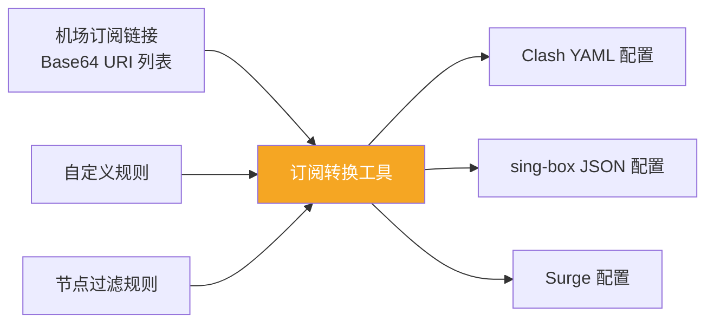
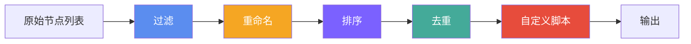
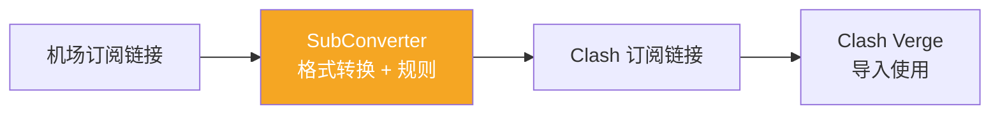
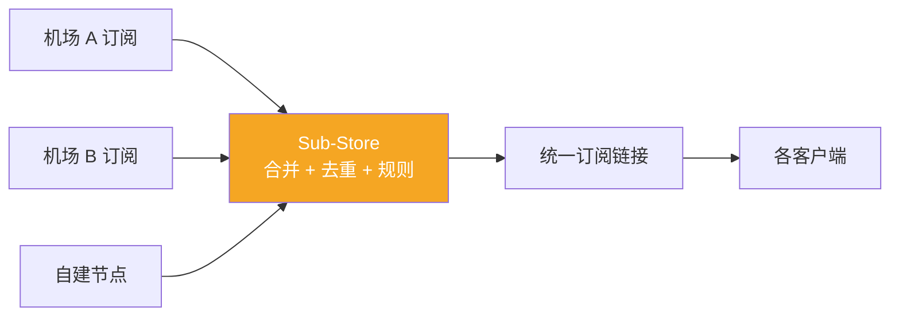
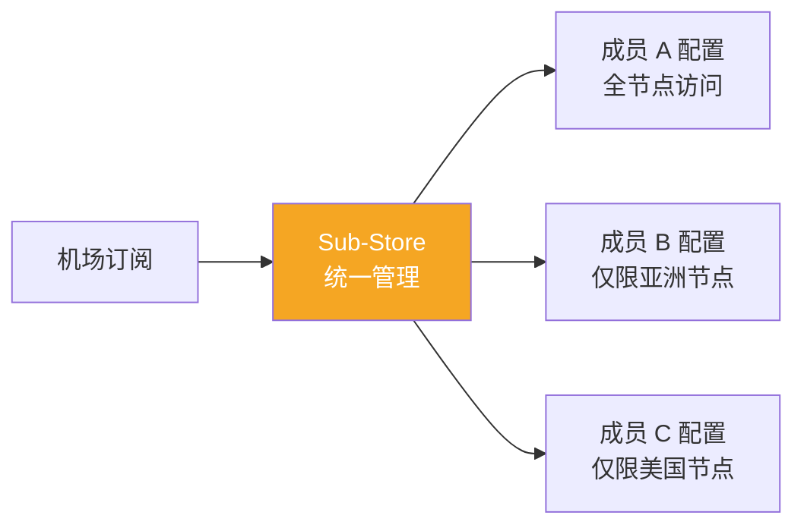

> **摘要**：代理订阅（Subscription）是机场向用户分发节点配置的标准方式。但不同客户端支持的订阅格式各不相同——Clash 需要 YAML 格式，sing-box 需要 JSON 格式，Shadowrocket 支持 Base64 编码的 URI 列表。订阅转换工具就是解决这个格式兼容问题的桥梁。本文详细介绍 SubConverter 和 Sub-Store 两大主流方案的原理、部署方法和使用技巧。

## 为什么需要订阅转换

### 格式碎片化

代理生态中存在多种订阅格式，每种客户端有自己的偏好：

| 客户端 | 支持的订阅格式 |
|--------|--------------|
| Clash / mihomo | YAML（Clash 配置文件） |
| sing-box | JSON（sing-box 配置文件） |
| Shadowrocket | Base64 编码 URI、Clash YAML |
| Quantumult X | 自有格式、URI 列表 |
| Surge | Surge 配置格式、URI 列表 |
| V2rayN | Base64 编码 URI、JSON |
| Loon | Loon 配置格式 |

一个机场可能只提供一种格式的订阅链接（通常是 Base64 编码的 URI 列表），但用户可能使用不同的客户端。订阅转换工具负责在这些格式之间进行转换。

### 自定义规则需求

即使格式兼容，用户往往需要自定义订阅内容：

- **添加自定义分流规则**：机场提供的默认规则可能不够精细
- **过滤节点**：去掉不需要的节点（如流量消耗节点、速度慢的节点）
- **重命名节点**：统一节点命名格式
- **添加额外的策略组**：如按地区分组、按用途分组



## SubConverter：经典订阅转换方案

[SubConverter](https://github.com/tindy2013/subconverter) 是最早也是最广泛使用的订阅转换工具，由 tindy2013 开发。它支持几乎所有主流订阅格式之间的互相转换。

### 核心功能

- **格式转换**：支持 Clash、Surge、Quantumult X、Loon、sing-box、SSD、SS/SSR/VMess URI 等格式之间的转换
- **规则集应用**：可以指定远程规则集（如 ACL4SSR、Loyalsoldier 等）
- **节点过滤**：按关键词包含或排除特定节点
- **节点重命名**：使用正则表达式批量重命名节点
- **自定义分组**：自定义策略组和分流规则

### 使用公共转换服务

最简单的使用方式是使用公共的 SubConverter 前端（如 [ACL4SSR 在线订阅转换](https://acl4ssr-sub.github.io/)）：

1. 粘贴你的机场订阅链接
2. 选择目标客户端类型（如 Clash）
3. 选择远程规则配置（如 ACL4SSR_Online_Full）
4. 点击生成，获取转换后的订阅链接

### 自建 SubConverter

公共服务有隐私风险——你的订阅链接（包含所有节点信息）会经过第三方服务器。自建 SubConverter 可以避免这个问题。

**Docker 部署**：

```bash
docker run -d --restart=always \
  -p 25500:25500 \
  --name subconverter \
  tindy2013/subconverter:latest
```

**配置文件（pref.toml）**：

```toml
[common]
# API 模式（设为 true 启用 API 访问）
api_mode = true

# 默认外部配置
default_external_config = ""

# 排除备注中的节点
exclude_remarks = ["(到期|剩余|流量|官网|续费)"]

# 插入自定义规则
enable_insert = true

# 过滤不支持的协议
filter_deprecated = true
```

**前端部署**（配合 [sub-web](https://github.com/CareyWang/sub-web) 使用）：

```bash
docker run -d --restart=always \
  -p 18080:80 \
  --name sub-web \
  careywong/subweb:latest
```

### SubConverter API 调用

SubConverter 提供 RESTful API，可以直接在 URL 中指定转换参数：

```
http://your-server:25500/sub?target=clash&url=你的订阅链接&config=远程规则配置
```

关键参数：

| 参数 | 说明 | 示例 |
|------|------|------|
| `target` | 目标格式 | clash, surge, quan, loon, singbox |
| `url` | 源订阅链接（需 URL 编码） | https%3A%2F%2Fexample.com%2Fsub |
| `config` | 远程规则配置 URL | ACL4SSR 规则配置 URL |
| `include` | 包含节点的正则 | 香港\|日本 |
| `exclude` | 排除节点的正则 | 过期\|维护 |
| `rename` | 重命名规则 | 旧名称@新名称 |
| `emoji` | 是否添加 emoji 标识 | true / false |
| `list` | 是否仅输出节点列表 | true / false |

### 常用远程规则配置

远程规则配置定义了策略组和分流规则。最常用的几个：

**ACL4SSR（推荐）**：

| 规则 | 说明 |
|------|------|
| ACL4SSR_Online | 基础版，常用分流 |
| ACL4SSR_Online_Full | 完整版，包含更多分类 |
| ACL4SSR_Online_Full_NoAuto | 完整版但无自动测速 |
| ACL4SSR_Online_Mini | 精简版，只保留必要分流 |

这些规则配置的 URL 可以在 [ACL4SSR 项目](https://github.com/ACL4SSR/ACL4SSR) 中找到。

## Sub-Store：更强大的订阅管理

[Sub-Store](https://github.com/sub-store-org/Sub-Store) 是一个功能更强大的订阅管理工具，由 Peng-YM 开发。与 SubConverter 的纯格式转换不同，Sub-Store 提供了完整的订阅管理能力。

### Sub-Store vs SubConverter

| 特性 | SubConverter | Sub-Store |
|------|-------------|-----------|
| 核心定位 | 格式转换 | 订阅管理平台 |
| 节点操作 | 过滤、重命名 | 过滤、重命名、排序、去重、脚本处理 |
| 自定义脚本 | 不支持 | 支持 JavaScript 脚本 |
| GUI 管理界面 | 需要额外前端 | 内置 Web 管理界面 |
| 多订阅合并 | 支持 | 支持，更灵活 |
| 学习曲线 | 较低 | 中等 |
| 部署复杂度 | 简单 | 中等 |

### 核心概念

Sub-Store 有几个核心概念需要理解：

**单条订阅（Subscription）**：对应一个机场的订阅链接，可以对其进行节点操作（过滤、重命名、排序等）。

**组合订阅（Collection）**：将多个单条订阅合并为一个，可以去重和统一管理。适合同时使用多个机场的用户。

**节点操作（Node Actions）**：对订阅中的节点进行处理的操作管道，按顺序执行：



### 部署 Sub-Store

**Docker 部署（推荐）**：

```bash
docker run -d --restart=always \
  -p 3001:3001 \
  -v /path/to/data:/data \
  --name sub-store \
  xream/sub-store:latest
```

**Vercel / Cloudflare Workers 部署**：

Sub-Store 也支持 Serverless 部署，不需要自己的服务器。具体步骤参考 [官方文档](https://github.com/sub-store-org/Sub-Store)。

### 使用 Sub-Store

部署完成后，通过浏览器访问 `http://your-server:3001` 打开管理界面。

**步骤 1：添加订阅**

在"单条订阅"页面，添加你的机场订阅链接：

- 名称：给订阅起一个识别名
- URL：粘贴机场提供的订阅链接
- User-Agent：部分机场根据 UA 返回不同格式，设为对应客户端的 UA

**步骤 2：配置节点操作**

为每个订阅配置节点操作管道：

- **正则过滤**：`(?i)(流量|到期|官网)` — 过滤掉信息节点
- **正则重命名**：`\s*\[.*?\]\s*` → `` — 去掉节点名中的方括号标签
- **排序**：按名称或类型排序
- **去重**：按服务器地址或名称去重

**步骤 3：创建组合订阅（可选）**

如果使用多个机场，创建一个组合订阅将它们合并。可以设置去重规则，避免不同机场提供的同一节点出现多次。

**步骤 4：获取转换后的链接**

Sub-Store 为每个订阅和组合订阅生成一个 URL，在客户端中使用这个 URL 作为订阅链接即可。URL 格式通常为：

```
http://your-server:3001/download/subscription-name?target=clash
```

### 自定义脚本（高级）

Sub-Store 最强大的功能是支持 JavaScript 脚本来处理节点。例如：

**为所有节点添加前缀**：

```javascript
function operator(proxies) {
  return proxies.map(p => {
    p.name = "🚀 " + p.name;
    return p;
  });
}
```

**按延迟排序**：

```javascript
function operator(proxies) {
  return proxies.sort((a, b) => {
    const delayA = a.delay || 9999;
    const delayB = b.delay || 9999;
    return delayA - delayB;
  });
}
```

**只保留特定地区的节点**：

```javascript
function operator(proxies) {
  const regions = ["香港", "日本", "台湾", "新加坡", "美国"];
  return proxies.filter(p => 
    regions.some(r => p.name.includes(r))
  );
}
```

## 安全与隐私注意事项

### 订阅链接的敏感性

订阅链接包含了你的所有代理节点信息（服务器地址、端口、密码/UUID 等）。任何获得这个链接的人都可以使用你的节点。因此：

1. **不要使用不可信的公共转换服务**：你的订阅链接会经过第三方服务器，对方可以记录你的所有节点信息
2. **优先自建转换服务**：使用 Docker 部署 SubConverter 或 Sub-Store
3. **定期更换订阅链接**：大多数机场支持重置订阅链接

### HTTPS 加密

如果自建转换服务，务必启用 HTTPS。订阅链接和转换后的配置中包含敏感信息，HTTP 明文传输存在被中间人截取的风险。

使用 Nginx 反代 + Let's Encrypt 证书：

```nginx
server {
    listen 443 ssl http2;
    server_name sub.your-domain.com;
    
    ssl_certificate /path/to/cert.pem;
    ssl_certificate_key /path/to/key.pem;
    
    location / {
        proxy_pass http://127.0.0.1:25500;
        proxy_set_header Host $host;
        proxy_set_header X-Real-IP $remote_addr;
    }
}
```

### Token 认证

Sub-Store 支持设置访问 Token，防止未授权的访问。在环境变量中设置：

```bash
SUB_STORE_FRONTEND_BACKEND_PATH=/your-secret-path
```

## 常见工作流

### 工作流一：单机场用户



最简单的场景：使用 SubConverter 将机场订阅转换为 Clash 格式，同时应用 ACL4SSR 分流规则。

### 工作流二：多机场用户



使用 Sub-Store 合并多个机场的订阅，去重后生成统一的订阅链接。

### 工作流三：团队共享



使用 Sub-Store 为不同成员生成不同的订阅（通过过滤规则控制可用节点）。

## 常见问题

### Q: 公共转换服务安全吗？

不建议在敏感场景下使用。公共转换服务的运营者可以记录你的订阅链接和节点信息。如果你对隐私有要求，应该自建转换服务。对于不涉及敏感操作的普通使用，知名的公共服务（如 ACL4SSR）通常是可信的，但风险自担。

### Q: 转换后的订阅链接会实时更新吗？

是的。转换服务会在每次请求时从原始订阅链接拉取最新节点，然后实时转换。所以当机场更新节点时，你的转换链接也会同步更新（需要在客户端中刷新订阅）。

### Q: SubConverter 和 Sub-Store 哪个好？

- 如果只需要简单的格式转换和规则应用：用 **SubConverter**，更简单
- 如果需要高级的节点管理（多机场合并、脚本处理、精细过滤）：用 **Sub-Store**，更强大
- 两者也可以配合使用：Sub-Store 管理节点，SubConverter 处理格式转换

### Q: 订阅更新频率应该设多少？

大多数客户端支持自动更新订阅。建议设为 12-24 小时更新一次。过于频繁的更新没有意义（机场不会每小时更换节点），且可能被机场视为异常行为。

### Q: 能否将 Clash 配置转换为 sing-box 配置？

可以。SubConverter 支持 `target=singbox` 输出。也可以使用 [sing-box 官方提供的转换工具](https://github.com/SagerNet/sing-box) 进行格式转换。

## 相关链接

- [SubConverter](https://github.com/tindy2013/subconverter) — 经典订阅转换后端
- [sub-web](https://github.com/CareyWang/sub-web) — SubConverter 前端界面
- [Sub-Store](https://github.com/sub-store-org/Sub-Store) — 高级订阅管理平台
- [ACL4SSR](https://github.com/ACL4SSR/ACL4SSR) — 最常用的远程分流规则
- [Loyalsoldier 规则集](https://github.com/Loyalsoldier/clash-rules) — 另一套高质量分流规则
- [ACL4SSR 在线转换](https://acl4ssr-sub.github.io/) — 公共转换前端

---

*订阅管理看似是代理使用中的"小事"，但一套好的订阅管理方案能显著提升日常使用体验——尤其是对多机场用户和需要精细分流的高级用户来说。*
