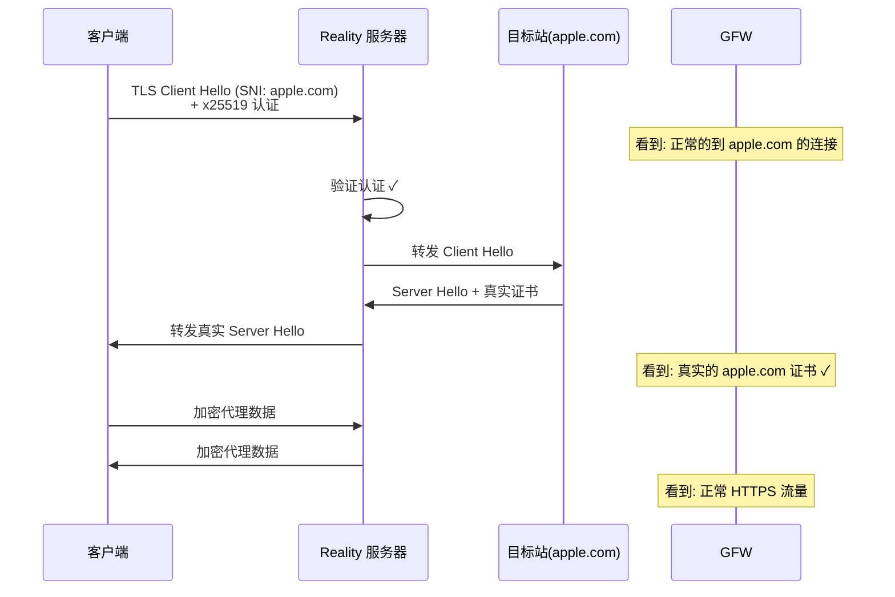
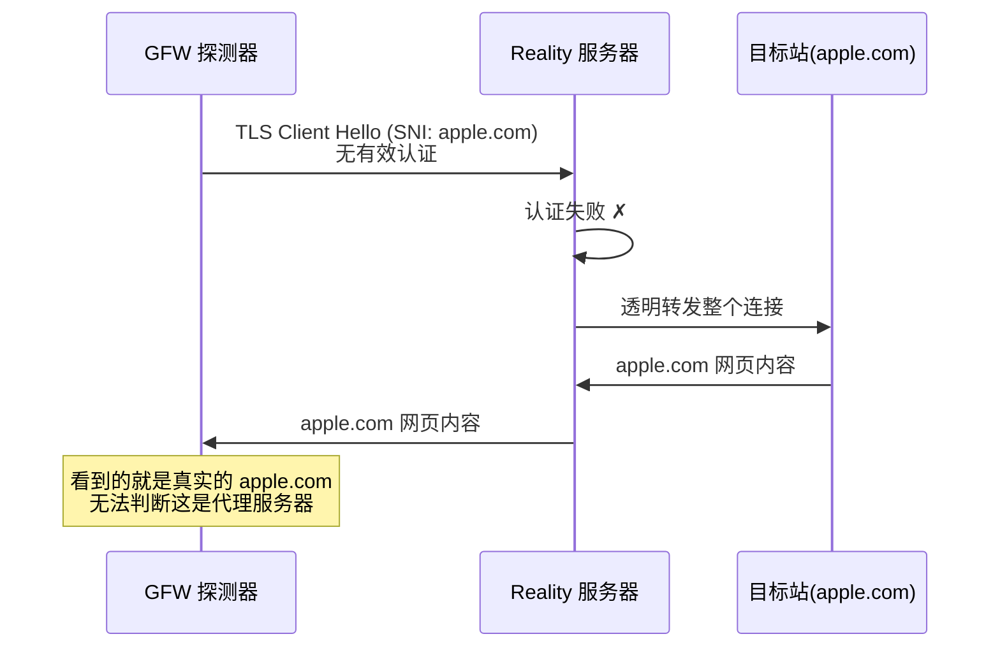

> **摘要**: VLESS + Reality 是当前最受推荐的代理协议组合。Reality 的核心创新在于"借用"真实网站的 TLS 证书进行伪装，使代理流量在 GFW 看来与正常 HTTPS 连接完全一致。本文深入解析 Reality 的工作原理、配置要点和最佳实践。

## VLESS 协议基础

要理解 VLESS，首先需要知道它的前身 VMess 出了什么问题。

VMess 是 V2Ray 时代的核心协议，它在协议层面内置了一套完整的加密方案——AES-128-GCM 或 ChaCha20-Poly1305。这在早期是合理的设计：当时的传输层可能没有加密保护，协议自己做加密是必要的安全措施。但后来情况发生了变化。

当代理社区逐步意识到流量伪装的重要性后，TLS 成为了几乎所有代理协议的标准外层封装。这时候问题就来了：**VMess 在 TLS 隧道内部又做了一层加密，而这层加密完全是多余的**。TLS 1.3 本身已经提供了足够强的加密保护（AES-256-GCM 或 ChaCha20-Poly1305），VMess 的内层加密既不提供额外安全性，又白白消耗了 CPU 资源。在高并发场景下，这种双重加密的性能开销是显著的——每一个数据包都要经过两次加解密运算。

VLESS 的设计思路非常直接：**既然外层已经有 TLS 了，协议本身就不需要再做加密**。VLESS 剥离了 VMess 中所有与加密相关的逻辑，只保留了最基本的两个功能——身份认证和数据传输。

但有一点必须强调：**VLESS 本身没有加密能力，绝对不能裸用**。在没有 TLS 或 Reality 保护的情况下使用 VLESS，你的所有代理流量（包括访问的目标地址）都是明文传输的，任何中间设备都可以直接看到内容。VLESS 必须搭配安全的传输层使用——而 Reality 正是当前最好的搭配。

此外，VLESS 支持一个重要的流量控制机制：**xtls-rprx-vision**。这个 flow 模式解决了传统 TLS 代理的一个隐蔽性问题——TLS-in-TLS 特征。xtls-rprx-vision 通过对内层 TLS 握手包进行填充（padding），打破了这种可识别的长度模式。需要注意的是，vision 目前仅支持 TCP 传输。

## Reality 是什么

在 Reality 出现之前，如果你想让代理流量看起来像正常的 HTTPS 连接，标准做法是使用 Trojan 或者 VLESS+TLS——也就是给你的代理服务器配一个真实的域名、申请一张真实的 TLS 证书。这种方案确实能让流量在加密层面看起来像 HTTPS，但存在三个根本性的弱点：域名和证书暴露身份、TLS 指纹与真实浏览器不一致（详见 [TLS 指纹与 uTLS](/posts/tls-fingerprinting/)）、主动探测可以暴露代理。

[Reality](https://github.com/XTLS/REALITY) 的设计目标就是**一次性解决以上所有问题**。它不需要你拥有任何域名，不需要你申请任何证书，也不依赖回落机制来应对探测。它的核心思路只有一句话：**借用目标网站的真实 TLS 证书来伪装自己**。


## Reality 工作原理（核心）


*图片来源：[Habr](https://habr.com/)*

### 正常客户端连接

当你的代理客户端连接到配置了 Reality 的服务器时，整个过程如下：

1. 客户端使用 [uTLS](https://github.com/refraction-networking/utls) 库生成与真实浏览器完全一致的 TLS Client Hello，SNI 填写 dest 目标站的域名（如 `apple.com`）
2. 客户端在 Client Hello 中嵌入基于 x25519 的认证数据
3. 服务端用预配置的私钥验证客户端身份
4. 服务端将 Client Hello 转发给真实目标站获取真实 TLS 证书
5. 服务端将真实证书转发给客户端完成握手
6. TLS 握手完成后切换到代理模式，VLESS 协议开始传输数据

**最终效果**：从 GFW 的视角来看，整个过程就是一个使用最新版 Chrome 浏览器访问 `apple.com` 的标准 HTTPS 连接。TLS 证书是真的，客户端指纹是真的，SNI 是真的——因为它们本来就是真的。



### 探测者连接

当 GFW 的主动探测系统向你的代理服务器发起连接时，由于探测者不知道私钥，服务端会将连接完全透明地代理到真实的目标站。探测者收到的所有响应都是直接来自目标站的真实数据。探测者无论怎么测试，都只能得出一个结论——这个 IP 上运行着一个正常的反向代理到目标站。




## 关键配置参数

### dest（目标站点）

选择 dest 的硬性要求：必须支持 TLS 1.3、必须支持 HTTP/2（H2）、目标站不能被墙。

最佳实践：选择大流量站点（如 `apple.com`、`www.microsoft.com`）、选择不太可能被封锁的站点、避免使用 CDN 分散的站点、不要使用已被广泛公开推荐的 dest。

### privateKey / publicKey

通过 `xray x25519` 生成的密钥对。`privateKey` 配置在服务端，`publicKey` 配置在客户端。**privateKey 必须严格保密**。

### shortId

额外的认证层，可为不同用户分配不同的 shortId，便于多用户管理。

### fingerprint

推荐使用 `chrome`，模拟最新版 Chrome 浏览器的 TLS 指纹。

### flow（xtls-rprx-vision）

对内层 TLS 握手包进行智能填充，对抗流量分析。仅支持 TCP 传输。


## 服务端配置示例（[Xray-core](https://github.com/XTLS/Xray-core) JSON，参考 [Xray 官方文档](https://xtls.github.io/)）

```json
{
  "inbounds": [
    {
      "listen": "0.0.0.0",
      "port": 443,
      "protocol": "vless",
      "settings": {
        "clients": [
          {
            "id": "your-uuid-here",
            "flow": "xtls-rprx-vision"
          }
        ],
        "decryption": "none"
      },
      "streamSettings": {
        "network": "tcp",
        "security": "reality",
        "realitySettings": {
          "dest": "apple.com:443",
          "serverNames": [
            "apple.com",
            "www.apple.com"
          ],
          "privateKey": "your-private-key-here",
          "shortIds": [
            "6ba85179e30d4fc2",
            "a1b2c3d4"
          ]
        }
      }
    }
  ],
  "outbounds": [
    {
      "protocol": "freedom",
      "tag": "direct"
    }
  ]
}
```

## 客户端配置（Clash/mihomo YAML）

```yaml
proxies:
  - name: "vless-reality"
    type: vless
    server: your-server-ip
    port: 443
    uuid: your-uuid-here
    network: tcp
    udp: true
    tls: true
    flow: xtls-rprx-vision
    servername: apple.com
    reality-opts:
      public-key: your-public-key-here
      short-id: 6ba85179e30d4fc2
    client-fingerprint: chrome
```

## 最佳实践

1. **使用标准端口 443**：与正常 HTTPS 流量保持一致。
2. **选择高流量的 dest 目标站**：不要从网上教程复制 dest 配置。
3. **启用 flow: xtls-rprx-vision**：几乎没有性能开销，但能有效缓解 TLS-in-TLS 特征。
4. **客户端指纹使用 chrome**：Chrome 是全球使用量最大的浏览器。
5. **定期检查 dest 站点的可达性**：至少准备 3 个以上备选 dest。
6. **为不同用户分配独立的 shortId**：便于权限管理和问题排查。
7. **代理服务器上不要运行其他公开服务**：保持"干净"。

## 常见问题

### Q: 使用 Reality 需要购买域名吗？

不需要。这是 Reality 相对于 Trojan 和传统 TLS 方案最大的优势之一。

### Q: 如果 dest 目标站被封了怎么办？

切换 dest。在服务端修改 `dest` 和 `serverNames` 配置，客户端同步更新 `servername`。提前准备 3 到 5 个经过测试的备选 dest 站点。

### Q: dest 目标站能看到我的代理流量吗？

不能。Reality 在 TLS 握手阶段与 dest 站点通信获取证书，但握手完成后，代理数据的传输完全在客户端和你的代理服务器之间进行，与 dest 站点没有任何数据交互。

### Q: 能通过 Reality 解锁 Netflix 等流媒体吗？

Reality 是传输层协议，它本身不影响流媒体解锁。能否解锁取决于你代理服务器的 IP 地址。

### Q: Reality 和 Trojan 相比，哪个更好？

在 2026 年的环境下，VLESS+Reality 在几乎所有维度上都优于 Trojan——抗检测能力更强、不需要域名和证书、运维成本更低。更多协议的横向对比参见 [主流代理协议横向对比](/posts/protocol-comparison/)。
