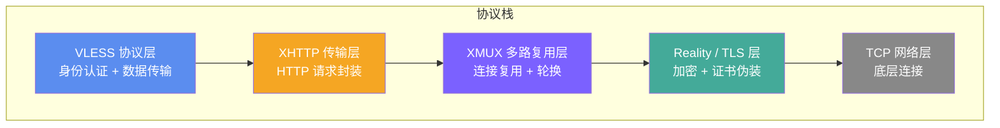
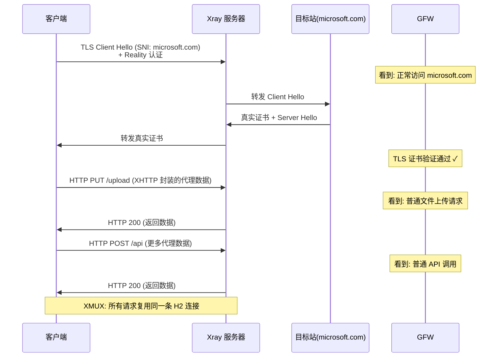

> **摘要**: VLESS+Reality 已经是公认的优秀方案，但它仍然有一个潜在弱点——长时间保持的 TLS 隧道本身就是一种流量特征。XHTTP 将代理流量进一步伪装为标准 HTTP 请求，配合 XMUX 多路复用降低连接开销，构成当前代理技术栈的天花板组合。本文深入解析 XHTTP 的设计原理、与其他传输方式的核心区别、完整配置方案以及实际部署中的注意事项。

## XHTTP 是什么

XHTTP 是 [Xray-core](https://github.com/XTLS/Xray-core) 在 2024 年推出的一种全新传输方式（transport）。它的核心思路非常直接：**将代理流量封装为普通的 HTTP 请求体（PUT/POST body），而不是通过 WebSocket 升级或 gRPC 流来传输数据**。

要理解 XHTTP 的设计动机，首先需要知道现有传输方式在 GFW 视角下暴露了什么。

在 VLESS+Reality 的经典配置中，代理流量通过一条持久的 TLS 隧道传输。虽然 Reality 让这条隧道在 TLS 层面完美伪装成访问真实网站，但隧道本身的行为模式——长时间保持连接、双向持续传输数据——与普通用户浏览网页的行为模式存在差异。GFW 的流量分析系统可以通过统计连接持续时间、数据包大小分布、传输时序等特征来标记可疑连接。

XHTTP 的解决方案是改变代理流量的传输形态。它不再使用持久隧道，而是将每一段代理数据包装成一个独立的 HTTP 请求。从网络层面看，这就是一系列标准的 HTTP PUT 或 POST 请求——与用户上传文件、提交表单、调用 API 的行为完全一致。每个请求都有明确的开始和结束，没有长连接特征。

XHTTP 支持三种工作模式，适应不同的网络环境：

- **packet-up**：上行数据通过多个短 HTTP 请求发送，下行通过一个长连接流式返回。这是最基本的模式，兼容性最好。
- **stream-up**：上行数据也通过流式传输发送，双向都使用长连接。性能更好，但要求中间网络设备支持流式上传。
- **stream-one**：上下行合并在同一个 HTTP 流中双向传输。性能最优，但对网络环境要求最高，需要完整的 HTTP/2 双向流支持。

## 为什么比 WebSocket 和 gRPC 更好

这个问题需要从 GFW 的检测视角来回答。每种传输方式都有自己的协议层特征，而 GFW 正是通过这些特征来识别和标记代理流量的。

### WebSocket 的弱点

WebSocket 传输需要一个从 HTTP 到 WebSocket 协议的升级过程。这个过程会在请求头中包含 `Upgrade: websocket` 和 `Connection: Upgrade` 这两个特殊字段。虽然 WebSocket 是一个合法的 Web 技术，但在实际互联网流量中，使用 WebSocket 的站点占比并不高。当 GFW 看到大量到同一个 IP 的 WebSocket 连接时，这本身就是一个值得关注的信号。

更关键的是，WebSocket 升级完成后会建立一条持久的双向通信通道，其流量模式（大量小包、双向交替传输）与代理流量的行为高度吻合。GFW 可以通过协议升级头 + 流量行为模式的组合来精准标记 WebSocket 代理。

### gRPC 的弱点

gRPC 基于 HTTP/2，但它使用特定的 `content-type: application/grpc` 头部。这是一个非常明确的协议指纹——gRPC 主要用于微服务间通信和 API 调用，普通用户的浏览器几乎不会产生 gRPC 流量。当 GFW 在一个看似普通的 HTTPS 连接中检测到 gRPC 特征时，基本可以确定这不是正常的网页浏览行为。

此外，gRPC 的流式传输模式也有独特的帧结构（以 5 字节长度前缀开头的 gRPC 消息帧），这在流量分析中可以被用作额外的识别依据。

### XHTTP 的优势

XHTTP 发出的请求就是标准的 HTTP PUT 或 POST 请求，使用 `application/octet-stream` 等通用的 content-type。没有协议升级头，没有特定的 content-type 指纹，没有特殊的帧结构。从 GFW 的视角看，这就是用户在上传文件或调用 RESTful API——互联网上最常见、最普通的 HTTP 行为。

| 特征维度 | WebSocket | gRPC | XHTTP |
|---------|-----------|------|-------|
| 协议升级头 | 有（Upgrade: websocket） | 无 | 无 |
| 特殊 content-type | 无 | 有（application/grpc） | 无 |
| 长连接特征 | 明显 | 明显 | 可选（packet-up 模式无长连接） |
| 帧结构特征 | WebSocket 帧 | gRPC 帧 | 标准 HTTP body |
| 在真实流量中的占比 | 低 | 极低 | 高 |
| GFW 识别难度 | 中等 | 较易 | 困难 |

## XMUX：多路复用

XHTTP 将代理流量拆分成多个独立的 HTTP 请求，这意味着每一段数据都需要建立连接、发送请求、等待响应。如果不做优化，这个过程的开销会很大——每次 HTTP 请求都需要经过 TCP 握手和 TLS 握手，延迟会显著增加。

XMUX（eXtended Multiplexing）正是为了解决这个问题而设计的。它的核心功能是**在一个底层 HTTP/2 连接中同时传输多条代理流**。HTTP/2 原生支持多路复用——多个请求和响应可以在同一条 TCP 连接上并行传输而互不干扰。XMUX 利用了这个特性，让多个 XHTTP 请求共享同一条已经建立好的连接，避免了重复的握手开销。

XMUX 提供了几个关键的配置参数来控制多路复用的行为：

- **maxConcurrency**：单个底层连接上允许同时传输的最大流数。设置得太高可能导致连接拥塞，太低则无法充分利用连接复用的优势。
- **maxConnections**：允许建立的最大底层连接数。多个连接可以分担负载，避免单点瓶颈。
- **cMaxReuseTimes**：每条底层连接的最大复用次数。达到上限后关闭旧连接并建立新连接，防止长时间使用同一连接导致的特征积累。
- **cMaxLifetimeMs**：每条底层连接的最大存活时间。超时后自动轮换连接，进一步降低被识别的风险。

XMUX 的连接轮换机制特别值得注意。传统代理通常会维持一条长连接传输所有数据，而 XMUX 通过定期建立新连接并关闭旧连接，使代理流量的连接模式更接近真实用户行为——真实用户也会不断地打开新页面、建立新连接。

## 完整协议栈：四层架构

VLESS + XHTTP + Reality + XMUX 这个组合中，每一层解决一个特定的问题。以下是它们如何协同工作的：



**VLESS（协议层）**：负责用户身份认证（通过 UUID）和代理数据的基本传输。VLESS 本身不做加密——加密由下层的 Reality 负责。这种设计避免了 VMess 时代双重加密的性能浪费。

**XHTTP（传输层）**：将 VLESS 的代理数据封装为标准的 HTTP 请求。每一段数据变成一个 PUT 或 POST 请求的 body，从外部看就是普通的 HTTP 流量。

**XMUX（多路复用层）**：管理底层 HTTP/2 连接的复用。多条代理流共享一个底层连接，定期轮换连接以降低特征暴露风险。

**Reality（TLS 伪装层）**：提供 TLS 加密，并借用真实网站的证书进行伪装。GFW 看到的是使用真实证书、真实 TLS 指纹的标准 HTTPS 连接。

**最终效果**：从 GFW 的视角来看，这是一个使用 Chrome 浏览器通过 HTTPS 向某个知名网站发送一系列普通 HTTP 请求的行为。TLS 证书是真的，浏览器指纹是真的，HTTP 请求格式是标准的——没有任何一个环节存在可识别的代理特征。



## 服务端配置示例（[Xray-core](https://github.com/XTLS/Xray-core) JSON，参考 [Xray 官方文档](https://xtls.github.io/)）

```json
{
  "inbounds": [
    {
      "listen": "0.0.0.0",
      "port": 443,
      "protocol": "vless",
      "settings": {
        "clients": [
          {
            "id": "your-uuid-here",
            "flow": ""
          }
        ],
        "decryption": "none"
      },
      "streamSettings": {
        "network": "xhttp",
        "xhttpSettings": {
          "mode": "auto",
          "path": "/your-custom-path"
        },
        "security": "reality",
        "realitySettings": {
          "dest": "www.microsoft.com:443",
          "serverNames": [
            "www.microsoft.com"
          ],
          "privateKey": "your-private-key-here",
          "shortIds": [
            "6ba85179e30d4fc2"
          ]
        }
      }
    }
  ],
  "outbounds": [
    {
      "protocol": "freedom",
      "tag": "direct"
    }
  ]
}
```

**配置要点说明**：

- `network` 设为 `xhttp`，启用 XHTTP 传输。
- `mode` 设为 `auto`，让 Xray 根据网络环境自动选择最优的 XHTTP 工作模式（packet-up / stream-up / stream-one）。也可以手动指定。
- `path` 是 HTTP 请求的路径前缀，客户端和服务端必须一致。建议使用不容易被猜到的随机路径。
- `flow` 留空——XHTTP 传输不支持 xtls-rprx-vision（vision 仅支持 TCP 传输）。这是从 VLESS+Reality（TCP）迁移到 VLESS+XHTTP+Reality 时最容易犯的配置错误。
- Reality 相关参数（`dest`、`privateKey`、`shortIds`）的配置原则与 VLESS+Reality 完全一致。

## 客户端配置示例（Clash/mihomo YAML）

```yaml
proxies:
  - name: "vless-xhttp-reality"
    type: vless
    server: your-server-ip
    port: 443
    uuid: your-uuid-here
    network: xhttp
    udp: true
    tls: true
    servername: www.microsoft.com
    xhttp-opts:
      mode: auto
      path: /your-custom-path
    reality-opts:
      public-key: your-public-key-here
      short-id: 6ba85179e30d4fc2
    client-fingerprint: chrome
```

**注意事项**：

- 客户端不要配置 `flow: xtls-rprx-vision`，XHTTP 传输下该选项不可用。
- `path` 必须与服务端保持完全一致。
- `client-fingerprint` 推荐 `chrome`，与 Reality 的最佳实践一致。
- 并非所有 Clash 分支都支持 XHTTP 传输，确认你使用的客户端版本支持此配置。

## 与其他传输方式的对比

| 对比维度 | TCP（裸） | WebSocket | gRPC | H2 (HTTP/2) | XHTTP |
|---------|----------|-----------|------|-------------|-------|
| 协议特征 | 无伪装 | 升级头暴露 | content-type 暴露 | 较少特征 | 无特殊特征 |
| 多路复用 | 不支持 | 不支持 | 支持 | 支持 | 支持（XMUX） |
| CDN 兼容性 | 不兼容 | 兼容 | 部分兼容 | 部分兼容 | 兼容 |
| 抗流量分析 | 弱 | 中等 | 中等 | 较强 | 强 |
| 连接轮换 | 不支持 | 不支持 | 不支持 | 不支持 | 支持（XMUX） |
| 性能开销 | 最低 | 低 | 低 | 低 | 中等 |
| 配置复杂度 | 简单 | 简单 | 中等 | 中等 | 较复杂 |
| flow(vision) 支持 | 支持 | 不支持 | 不支持 | 不支持 | 不支持 |
| 推荐搭配 | Reality | CDN 中转 | CDN 中转 | Reality | Reality |

**选择建议**：

- **最高隐蔽性**需求：XHTTP + Reality + XMUX
- **平衡性能与安全**：TCP + Reality + vision（经典方案，仍然非常可靠）
- **需要 CDN 中转**：WebSocket（兼容性最好）或 XHTTP（隐蔽性更好）
- **简单部署**：TCP + Reality

## 性能考量

XHTTP 的 HTTP 封装不可避免地引入了额外开销，但在实际使用中，这些开销是否值得关注取决于你的使用场景。

**额外开销来源**：

1. HTTP 请求头和响应头的字节开销。每个 XHTTP 请求都需要附带标准的 HTTP 头部信息，这些数据不携带任何代理流量但占用带宽。
2. 请求-响应模型的延迟开销。在 packet-up 模式下，每段数据都需要等待服务端的 HTTP 响应，增加了一个 RTT 的延迟。
3. XMUX 的连接管理开销。连接轮换、流调度等逻辑需要消耗额外的 CPU 和内存。

**实际影响评估**：

- 对于日常网页浏览、视频流媒体等场景，XHTTP 的额外开销几乎不可感知。现代网页本身就包含大量 HTTP 请求，额外几个字节的头部开销可以忽略不计。
- 对于大文件下载或高带宽传输场景，stream-up 或 stream-one 模式可以显著降低开销，性能接近传统 TCP 传输。
- 对于延迟敏感型应用（如在线游戏），packet-up 模式的额外 RTT 可能有一定影响。建议对延迟极度敏感的场景仍使用 TCP + Reality + vision。

总的来说，XHTTP 用可接受的性能代价换取了显著更高的隐蔽性。在当前 GFW 检测能力持续提升的背景下，这个权衡对大多数用户来说是值得的。

## 客户端支持情况

XHTTP 作为 Xray-core 推出的传输方式，客户端支持仍在逐步扩展中。

**完整支持**：

- [Xray-core](https://github.com/XTLS/Xray-core) 原生支持，这是 XHTTP 的参考实现
- 基于 Xray-core 的 GUI 客户端（如 v2rayN、v2rayA 等）通常可以通过自定义配置使用

**部分支持**：

- 部分 sing-box 版本已经实现了 XHTTP 的基本支持，但 XMUX 的实现进度可能落后于 Xray-core
- mihomo（Clash.Meta）对 XHTTP 的支持取决于具体版本，建议关注项目更新日志

**暂不支持**：

- 原版 Clash（已停止维护）
- 部分较旧的移动端客户端

使用 XHTTP 之前，务必确认你的客户端和内核版本是否支持。建议直接使用最新版 Xray-core 以获得最完整的功能支持。

## 部署注意事项

1. **flow 必须留空**：这是最常见的配置错误。XHTTP 传输不兼容 `xtls-rprx-vision`，如果你从 TCP + Reality 迁移过来，一定要删除 flow 配置。
2. **path 保持一致**：服务端和客户端的 `path` 必须完全一致，包括大小写和前缀斜杠。
3. **端口使用 443**：与标准 HTTPS 保持一致，避免使用非常规端口引起注意。
4. **XMUX 参数调优**：初始配置使用默认值即可，后续根据实际使用情况调整 `maxConcurrency` 和 `cMaxLifetimeMs`。不建议将 `maxConcurrency` 设得过高。
5. **mode 选择**：建议使用 `auto` 让 Xray 自动选择。如果你确定网络环境支持，可以手动指定 `stream-one` 以获得最佳性能。
6. **监控连接质量**：XHTTP 的 HTTP 封装对网络质量有一定要求，如果发现频繁断连，尝试切换到 `packet-up` 模式或降低 XMUX 的并发参数。

## 常见问题

### Q: XHTTP 需要额外的 Web 服务器（如 Nginx）吗？

不需要。Xray-core 内置了对 XHTTP 的完整处理能力，不需要前置 Nginx 或 Caddy。Reality 本身就充当了 TLS 终端，Xray 直接处理解密后的 HTTP 请求。

### Q: XHTTP 和 H2（HTTP/2）传输有什么区别？

H2 传输是利用 HTTP/2 的流机制来传输代理数据，但它仍然是一条持久连接。XHTTP 则是将数据封装为独立的 HTTP 请求，可以利用 packet-up 模式实现短连接特征。此外 XHTTP 支持 XMUX 连接轮换，H2 不具备这个能力。

### Q: 从 VLESS+Reality 迁移到 VLESS+XHTTP+Reality 复杂吗？

迁移本身不复杂，主要修改三个地方：将 `network` 从 `tcp` 改为 `xhttp`，添加 `xhttpSettings` 配置，删除 `flow` 配置。但需要注意的是，客户端也需要同步更新配置并确认支持 XHTTP。

### Q: 是否所有用户都应该升级到 XHTTP？

不一定。如果你当前使用 VLESS+Reality+vision 方案运行稳定且未受到干扰，不必急于迁移。XHTTP 更适合以下场景：所在地区对长连接有针对性检测、需要通过 CDN 中转流量、追求极致的流量伪装效果。对于大多数用户，经典的 TCP+Reality+vision 方案在 2026 年仍然是足够可靠的选择。

### Q: XHTTP 能配合 CDN 使用吗？

可以。XHTTP 封装的就是标准 HTTP 请求，理论上可以通过支持 HTTP/2 的 CDN 进行中转。但使用 CDN 时无法使用 Reality（CDN 需要自己的 TLS 证书），安全性会有所降低。CDN 中转主要用于 IP 被封后的应急方案，不建议作为日常方案。

### Q: XMUX 的连接轮换会不会影响稳定性？

正常情况下不会。XMUX 在轮换连接时会确保当前正在传输的数据流不受影响，新的数据流会被分配到新建的连接上。如果发现轮换过程中出现短暂断连，可以适当增大 `cMaxLifetimeMs` 参数来降低轮换频率。

## 参考链接

- [Xray-core GitHub 仓库](https://github.com/XTLS/Xray-core) - XHTTP 和 XMUX 的参考实现
- [Xray 官方文档](https://xtls.github.io/) - 完整的配置文档和参数说明
- [REALITY 项目](https://github.com/XTLS/REALITY) - Reality 协议的设计文档和技术细节
